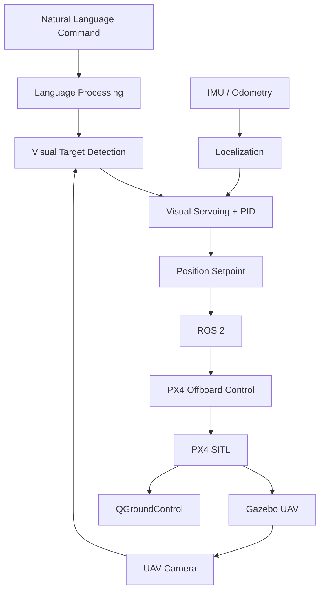

<p align="center">
  
</p>

#  Vision-Language UAV Navigation for GPS-Denied Environments

### Vision-Language Navigation | UAV | Computer Vision | GPS-Denied Navigation | ROS 2 | PX4 | Gazebo

</div>

---

## Team Members

| S. No. | Name | Roll Number | Email |
|---|---|---|---|
| 1 | JENISHAA BHARATHI M | CB.SC.U4AIE24221 | cb.sc.u4aie24221@cb.students.amrita.edu |
| 2 | NAVEEN K | CB.SC.U4AIE24235 | cb.sc.u4aie24235@cb.students.amrita.edu |
| 3 | POOJA N | CB.SC.U4AIE24242 | cb.sc.u4aie24242@cb.students.amrita.edu |
| 4 | PRANESH M | CB.SC.U4AIE24345 | cb.sc.u4aie24345@cb.students.amrita.edu |
| 5 | SANDHIYA D | CB.SC.U4AIE24353 | cb.sc.u4aie24353@cb.students.amrita.edu |

---

# Abstract

Unmanned Aerial Vehicles (UAVs) traditionally rely on predefined GPS waypoints or precise manual control, limiting their flexibility in dynamic environments. This project introduces a **Vision-Language Navigation framework** that enables autonomous drones to understand and execute natural language navigation commands. By combining computer vision with natural language processing, the system interprets instructions such as **"Navigate past the blue sign and stop near the door"**, processes live camera input, identifies relevant visual targets, and dynamically generates navigation commands.

The framework provides a modular foundation for developing, simulating, and testing intelligent aerial navigation systems in GPS-denied environments.

---

# Introduction

### Evolving Aerial Autonomy
UAVs are transitioning from manually operated aircraft to autonomous systems capable of navigating complex and unpredictable environments.

### Visual Perception Challenge
Real-time interpretation of camera data and rapid flight adjustment remain major challenges in autonomous aerial navigation.

### Integrated ROS 2 Architecture
This project combines computer vision with a modular **ROS 2 flight-control architecture** for visual target tracking and autonomous navigation.

### Simulation
**Gazebo and PyBullet** provide realistic physics, sensor data, and camera simulation for safe testing without physical hardware.

### PX4 Integration
**PX4** provides flight stabilization, telemetry, waypoint management, and low-level control required for autonomous UAV operation.

---

# Methodology

The system combines the following core modules:

- **PyBullet + gym-pybullet-drones:** UAV, camera, physics, and target-tracking simulation.
- **OpenCV:** Camera processing and visual target detection.
- **Visual Servoing + PID:** Converts image-space target errors into UAV motion commands.
- **ROS 2:** Communication layer connecting perception, localization, and flight control.
- **PX4 SITL + Gazebo:** Autonomous flight simulation and low-level control.
- **PX4 State Bridge:** Publishes UAV odometry and state to ROS 2.
- **NED–ENU + TF/Odometry:** Maintains consistent UAV coordinate frames.
- **PX4 Offboard Control:** Sends position setpoints to the UAV.
- **QGroundControl:** Provides telemetry and flight-state monitoring.

### Flight Sequence

```text
ARM → TAKEOFF → HOVER → WAYPOINT → RETURN → LAND
```

---

# System Architecture



---

# How the Main UAV-VLN System Works

The system converts a natural-language mission into an autonomous UAV navigation task through a sequence of perception, localization, planning, and control stages.

## Overall Flow

```text
Natural Language
       ↓
      VLM
       ↓
Semantic Target
       ↓
Grounding DINO
       ↓
2D Bounding Box
       ↓
Depth + Camera Geometry
       ↓
3D Target Point
       ↓
SLAM
       ↓
UAV Pose + Environment Map
       ↓
Semantic Memory
       ↓
Path Planner
       ↓
Trajectory / Waypoints
       ↓
ROS 2
       ↓
PX4 Offboard
       ↓
UAV
       ↓
New Camera + IMU Data
       ↺
```

## 1. Vision-Language Understanding

The system begins with a natural-language mission from the operator.

**Example:**

> "Locate the injured person near the collapsed staircase and avoid smoke."

A Vision-Language Model (VLM), such as LLaVA or BLIP-2, interprets the mission and extracts the relevant semantic information.

```text
Input:
"Locate the injured person near the collapsed staircase."

                ↓
               VLM
                ↓

Target      → Injured Person
Landmark    → Collapsed Staircase
Action      → Locate / Navigate
Hazard      → Smoke
```

The VLM answers:

> "What is the UAV being asked to find or do?"

Its output is a semantic mission description, not a motor command.

## 2. Visual Grounding with Grounding DINO

Once the target is understood, the system needs to determine where that target appears in the camera image.

Grounding DINO performs text-conditioned visual grounding.

```text
RGB Image + Text Query
          ↓
     Grounding DINO
          ↓
Bounding Box + Confidence
```

For example:

```text
Text Query: "injured person"

Bounding Box:
[x1, y1, x2, y2]

Confidence:
0.91
```

This converts:

```text
"What am I looking for?"
        ↓
"Where is it in the image?"
```

> **Note:** The current baseline uses color-based visual detection. Grounding DINO is the planned open-vocabulary grounding component.

## 3. 2D Detection to 3D Localization

A bounding box gives the target location in image coordinates, but the UAV needs a 3D position.

The center of the bounding box is calculated as:

```text
u = (x1 + x2) / 2
v = (y1 + y2) / 2
```

The depth camera provides the distance `Z` of the target from the camera.

Using camera intrinsics:

```text
X = (u - cx) Z / fx
Y = (v - cy) Z / fy
```

The result is the target position in the camera frame:

```text
Pc = [X, Y, Z]
```

The conversion is therefore:

```text
2D Bounding Box
       ↓
Target Pixel (u, v)
       ↓
Depth Measurement
       ↓
Camera Geometry
       ↓
3D Target Point
```

This answers:

> "Where is the target relative to the camera?"

## 4. Camera Frame to World Frame

The target is initially represented in the camera coordinate system. For navigation, it must be represented in the world/map coordinate system.

```text
Target in Camera Frame
          ↓
     Camera → Body
          ↓
      Body → World
          ↓
Target in World Frame
```

Conceptually:

```text
Pw = Twb · Tbc · Pc
```

where:

- `Pc` = target position in camera coordinates
- `Tbc` = camera-to-body transformation
- `Twb` = UAV body-to-world transformation
- `Pw` = target position in the world frame

This requires an accurate estimate of the UAV's pose.

## 5. GPS-Denied Localization using Visual SLAM

For GPS-denied operation, the UAV uses visual and inertial information to estimate its own position.

```text
RGB / Depth Camera
        +
       IMU
        ↓
Visual-Inertial SLAM
        ↓
UAV Pose + Environment Map
```

SLAM estimates:

- UAV position
- UAV orientation
- Camera trajectory
- Visual landmarks
- Environment map

The camera tracks visual features such as:

- Building corners
- Windows
- Doors
- Walls
- Debris
- Other landmarks

The IMU provides:

- Angular velocity
- Linear acceleration

These measurements are combined to estimate the UAV's motion.

> A candidate implementation for this stage is **ORB-SLAM3**.

The key output is:

```text
SLAM
 ↓
"Where am I?"
+
"What does my environment look like?"
```

The estimated UAV pose is then used to transform detected targets from the camera frame into the world frame.

## 6. Adaptive Semantic Memory

SLAM provides the geometric representation of the environment, while semantic perception provides information about what the observed regions and objects represent.

Semantic memory associates objects and events with their locations and context.

**Example:**

```text
Object      : Injured Person
Location    : (x, y, z)
Landmark    : Collapsed Staircase
Hazard      : Smoke
Confidence  : 0.91
```

New observations can update previously stored information:

```text
New Observation
       ↓
Semantic Information
       ↓
Memory Update
       ↓
Existing Knowledge
```

The memory can store:

- Objects
- Victims
- Landmarks
- Hazards
- Explored regions
- Blocked regions
- Previously observed locations
- Confidence values

This allows the UAV to reuse previously acquired information during navigation.

## 7. Path Planning

Once the system knows:

```text
Current UAV Pose
        +
Target Position
        +
Obstacle / Map Information
```

the problem becomes a path-planning problem.

The planner generates a collision-free route toward the target.

```text
Current Pose
     +
Target Pose
     +
Obstacle Map
     ↓
Path Planner
     ↓
Collision-Free Path
     ↓
Waypoints / Trajectory
```

Candidate planning approaches include:

- A*
- RRT
- RRT*

The planner can re-plan when new obstacles or environmental information are detected.

## 8. ROS 2 Communication

ROS 2 connects the individual components of the autonomy stack.

The main information flow is:

```text
Mission Instruction
       ↓
VLM / Perception
       ↓
Target Detection
       ↓
3D Localization
       ↓
SLAM / Semantic Map
       ↓
Path Planner
       ↓
Flight Controller
```

The system is divided into independent ROS 2 nodes for:

- Perception
- Detection
- Localization
- State estimation
- Mission management
- Planning
- Flight control

The UAV state is also converted between PX4 and ROS 2 coordinate conventions:

```text
PX4 Odometry
      ↓
state_bridge
      ↓
NED → ENU
      ↓
ROS 2 Pose
```

## 9. PX4 Offboard Flight Control

The path planner does not directly control the motors.

Instead, it generates position or trajectory setpoints which are sent to PX4 through ROS 2 Offboard Control.

```text
Planned Waypoints
       ↓
ROS 2 Flight Controller
       ↓
PX4 Offboard
       ↓
Position / Trajectory Control
       ↓
Attitude + Rate Control
       ↓
Motor Commands
       ↓
UAV Motion
```

The ROS 2 autonomy stack determines:

> Where should the UAV go?

PX4 handles:

> How should the UAV execute the commanded trajectory?

This separates high-level autonomous navigation from low-level flight stabilization.

## 10. Complete Closed-Loop Navigation

The complete system operates as a feedback loop.

```text
Natural Language
       ↓
      VLM
       ↓
Grounding DINO
       ↓
2D Target
       ↓
Depth + Camera Geometry
       ↓
3D Target
       ↓
SLAM
       ↓
Pose + Map
       ↓
Semantic Memory
       ↓
Path Planning
       ↓
PX4
       ↓
UAV Motion
       ↓
New Camera + IMU Data
       ↺
```

The fundamental loop is:

```text
PERCEIVE
   ↓
UNDERSTAND
   ↓
LOCALIZE
   ↓
REMEMBER
   ↓
PLAN
   ↓
ACT
   ↓
PERCEIVE AGAIN
```

This allows new observations to update the UAV's pose, map, semantic knowledge, and navigation decisions.

### Main Technical Flow

```text
Language
   ↓
VLM
   ↓
Semantic Target
   ↓
Grounding DINO
   ↓
2D Bounding Box
   ↓
Depth + Camera Geometry
   ↓
3D Camera Point (Pc)
   ↓
SLAM Pose + Coordinate Transform
   ↓
3D World Point (Pw)
   ↓
Semantic Map / Memory
   ↓
Path Planner
   ↓
Trajectory / Waypoints
   ↓
ROS 2
   ↓
PX4 Offboard
   ↓
UAV Motion
   ↓
Camera + IMU
   ↺
```

### Core Transformation

```text
Language
    ↓
VLM
    ↓
BBox
    ↓
Grounding DINO
    ↓
Pc
    ↓
Depth + Camera Geometry
    ↓
Pw
    ↓
SLAM Pose
    ↓
Path
    ↓
PX4
    ↓
UAV
```


https://github.com/user-attachments/assets/437d402a-7b3b-4a8a-8b44-ca0b5fdd62d4


## Base Paper

This project is inspired by the UAV Vision-Language Navigation problem studied in:

> **Towards Realistic UAV Vision-Language Navigation: Platform, Benchmark, and Methodology**

**Paper:**  
https://arxiv.org/pdf/2410.07087

**TravelUAV Repository:**  
https://github.com/buaa-colalab/TravelUAV

The paper provides the research foundation for the Vision-Language Navigation aspect of this project, while this repository develops an independent simulation and ROS 2–PX4 based implementation.

---

<div align="center">

### Amrita Vishwa Vidyapeetham

**Vision-Language UAV Navigation for GPS-Denied Environments**

</div>
