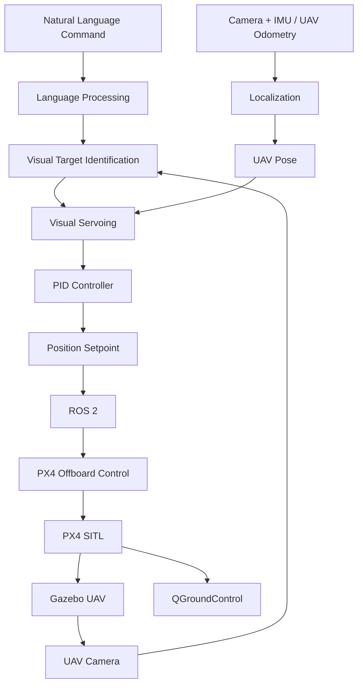

# Vision-Language UAV Navigation for GPS-Denied Environments

[](https://docs.ros.org/en/humble/)
[](https://gazebosim.org/)
[](https://px4.io/)
[](https://qgroundcontrol.com/)
[](https://www.python.org/)
[](LICENSE)

**Vision-Language Navigation | UAV | Computer Vision | GPS-Denied Navigation | ROS 2 | PX4 | Gazebo**

---

## Team Members

| S. No. | Name | Roll Number | Email |
|---|---|---|---|
| 1 | JENISHAA BHARATHI M | CB.SC.U4AIE24221 | cb.sc.u4aie24221@cb.students.amrita.edu |
| 2 | NAVEEN K | CB.SC.U4AIE24235 | cb.sc.u4aie24235@cb.students.amrita.edu |
| 3 | POOJA N | CB.SC.U4AIE24242 | cb.sc.u4aie24242@cb.students.amrita.edu |
| 4 | PRANESH M | CB.SC.U4AIE24345 | cb.sc.u4aie24345@cb.students.amrita.edu |
| 5 | SANDHIYA D | CB.SC.U4AIE24353 | cb.sc.u4aie24353@cb.students.amrita.edu |

---

# Abstract

Unmanned Aerial Vehicles (UAVs) traditionally rely on predefined GPS waypoints or precise manual control, limiting their flexibility in dynamic environments. This project introduces a **Vision-Language Navigation framework** that enables autonomous drones to understand and execute natural language navigation commands. By pairing computer vision with natural language processing, the system interprets spoken or written instructions (e.g., **"Navigate past the blue sign and stop near the door"**), processes live visual input from the drone’s camera, and dynamically plans safe flight paths.

Designed as a modular and accessible foundation, this repository provides a starting point for building, simulating, and deploying intelligent aerial navigation systems from scratch.

---

# Introduction

### Evolving Aerial Autonomy

Unmanned Aerial Vehicles (UAVs) are transitioning from manually operated aircraft to self-directing systems that can navigate complex, unpredictable spaces independently.

### Visual Perception Challenge

Enabling drones to process visual data and make split-second, autonomous path adjustments in real time remains a key engineering bottleneck.

### Integrated ROS 2 Architecture

This project addresses that challenge by combining computer vision algorithms with a modular **ROS 2 flight-control system** to track dynamic, moving targets.

### Role of Simulation Tools

Environments such as **Gazebo and PyBullet** are necessary to model realistic physics, sensor data, and camera streams, allowing safe algorithm testing without risking physical hardware damage.

### PX4 Integration

Utilizing **PX4** provides essential flight stabilization, waypoint management, telemetry, and low-level flight control required to translate vision and navigation commands into precise flight maneuvers.

### Bridging Code and Flight

The primary goal of this repository is to offer an accessible, end-to-end framework built from scratch that bridges raw code with actual aerial autonomy.

---

# Methodology

The project integrates UAV simulation, visual perception, localization, navigation, and flight control through the following modules:

- **PyBullet + gym-pybullet-drones:** Simulates the UAV, environment, camera, physics, and target-tracking experiments.
- **Simulated UAV Camera:** Provides RGB images of the environment for visual target detection and tracking.
- **OpenCV:** Processes camera frames and extracts the visual target using image-based detection.
- **Moving Target Module:** Generates circular, figure-eight, waypoint, and random target trajectories for tracking evaluation.
- **Visual Servoing:** Calculates the target's image-space error relative to the camera centre and converts it into UAV motion commands.
- **PID Controller:** Controls horizontal alignment, vertical alignment, forward motion, and yaw using visual tracking errors.
- **Body-to-World Transformation:** Converts UAV-relative motion commands into world-frame motion using the UAV orientation/quaternion.
- **Position Setpoint Generation:** Converts tracking velocity commands into bounded position setpoints for stable UAV movement.
- **gym-pybullet-drones PID Control:** Converts high-level position commands into low-level UAV control/motor actions in the PyBullet simulation.
- **ROS 2:** Provides the communication and integration layer between UAV state, navigation, and flight-control modules.
- **PX4 SITL:** Provides the UAV autopilot and low-level flight-control system for autonomous takeoff, hovering, waypoint navigation, return, and landing.
- **PX4 State Bridge:** Receives PX4 vehicle odometry and publishes UAV state through ROS 2.
- **NED–ENU Transformation:** Converts PX4's NED coordinates into ROS 2's ENU convention for consistent state representation.
- **ROS 2 TF / Odometry:** Publishes UAV pose and maintains the `odom → base_link` transformation.
- **PX4 Offboard Control:** Sends external position setpoints to PX4 for autonomous flight.
- **Flight State Machine:** Implements the sequence:
  `ARM → TAKEOFF → HOVER → WAYPOINT → RETURN → LAND`.
- **Gazebo:** Provides the PX4-based UAV simulation environment and physical flight simulation.
- **QGroundControl:** Provides UAV telemetry, flight-state monitoring, and ground-control visualization.

---

# System Architecture



---

# Flight State Sequence

```text
ARM
 ↓
TAKEOFF
 ↓
HOVER
 ↓
WAYPOINT
 ↓
RETURN
 ↓
LAND
```

---

# Toy Example

Consider the natural-language command:

> **"Find the red building near the road and fly to it."**

### 1. Language Understanding

```text
Object    = Building
Attribute = Red
Relation  = Near Road
Action    = Navigate
```

The language instruction and camera image are used to identify the target:

$$
B = Ground(I,L)
$$

where:

- $I$ = camera image
- $L$ = language instruction
- $B$ = detected target region

### 2. Target Localization

Assume the UAV position is:

$$
P_{UAV}=(0,0,5)\;m
$$

and the detected target position is:

$$
P_{target}=(10,8,5)\;m
$$

The position error is:

$$
e_p=P_{target}-P_{UAV}
$$

Therefore:

$$
e_p=
\begin{bmatrix}
10\\
8\\
0
\end{bmatrix}m
$$

The distance to the target is:

$$
d=
\sqrt{(10-0)^2+(8-0)^2+(5-5)^2}
$$

$$
d=\sqrt{164}\approx12.81\;m
$$

### 3. Waypoint Generation

The navigation module generates intermediate setpoints:

```text
Start
(0,0,5)
   ↓
Waypoint 1
(3,2,5)
   ↓
Waypoint 2
(6,5,5)
   ↓
Target
(10,8,5)
```

A position setpoint can be represented as:

$$
W_i=[x_i,y_i,z_i,\psi_i]
$$

The generated trajectory is:

$$
\mathcal{T}=\{W_1,W_2,\ldots,W_N\}
$$

### 4. Target-Reached Condition

The UAV continuously calculates:

$$
d=
\sqrt{(x_g-x)^2+(y_g-y)^2+(z_g-z)^2}
$$

If:

$$
d<\epsilon
$$

the target is considered reached, where $\epsilon$ is the acceptance radius.

### 5. Complete Navigation Flow

```text
Natural Language Command
          ↓
   Language Processing
          ↓
 Visual Target Detection
          ↓
 Target Localization
          ↓
   Waypoint Generation
          ↓
        ROS 2
          ↓
   PX4 Offboard Control
          ↓
       PX4 SITL
          ↓
        Gazebo
          ↓
      Target Reached
          ↓
         LAND
```

---

# Project Objective

The overall objective is to develop a modular UAV navigation framework that combines **natural-language understanding, computer vision, localization, visual servoing, ROS 2, PX4, and simulation** to enable autonomous navigation without depending entirely on predefined GPS waypoints.
