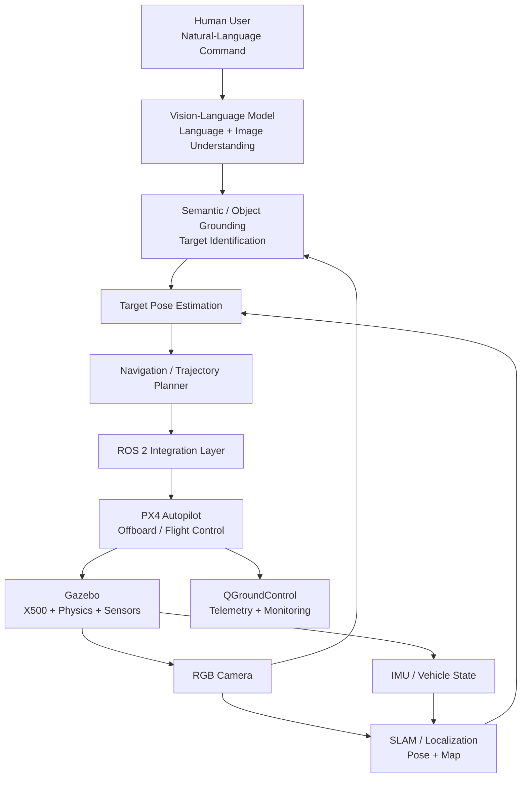
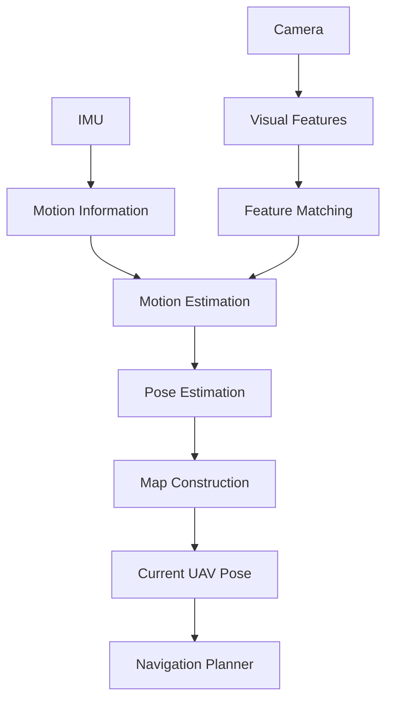
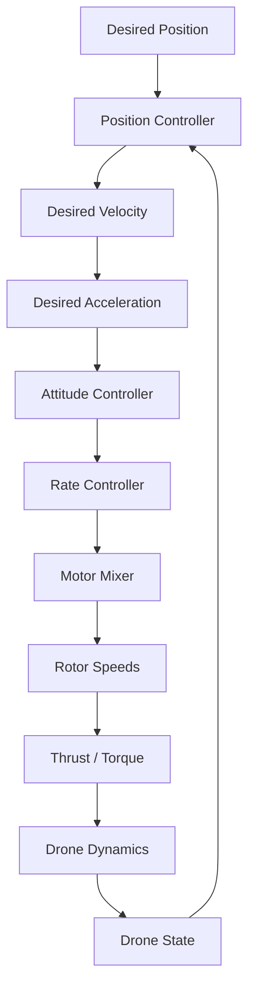
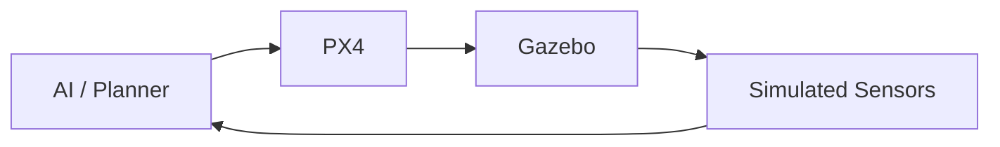
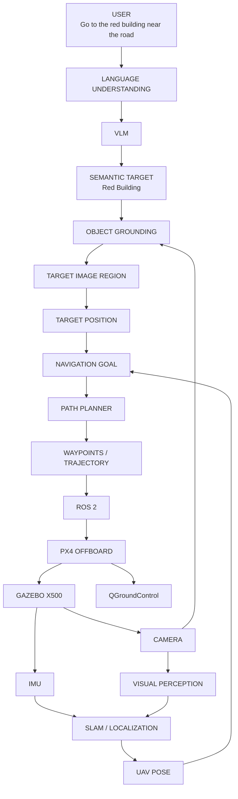
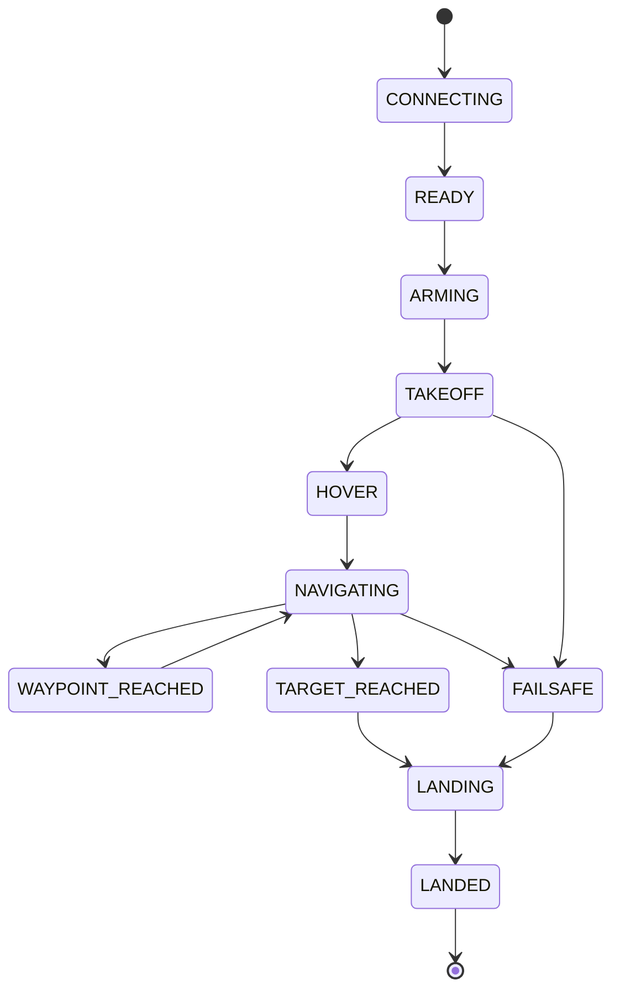
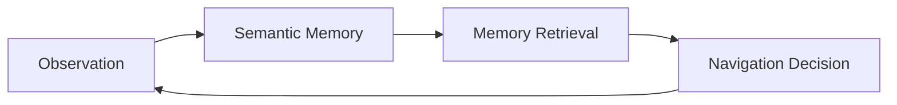

# Vision-Language UAV Navigation for GPS-Denied Environments

<p align="center">


</p>

[](https://docs.ros.org/en/humble/)
[](https://gazebosim.org/)
[](https://px4.io/)
[](https://qgroundcontrol.com/)
[](https://www.python.org/)
[](https://opencv.org/)
[](https://pytorch.org/)
[](LICENSE)

**Autonomous Aerial Robotics | Vision-Language Navigation | Semantic Grounding | SLAM | GPS-Denied Navigation | ROS 2 | PX4 | Gazebo**

---

# Team Members

| S. No. | Name                | Roll Number      | Email                                                                                     |
| ------ | ------------------- | ---------------- | ----------------------------------------------------------------------------------------- |
| 1      | JENISHAA BHARATHI M | CB.SC.U4AIE24221 | [cb.sc.u4aie24221@cb.students.amrita.edu](mailto:cb.sc.u4aie24221@cb.students.amrita.edu) |
| 2      | NAVEEN K            | CB.SC.U4AIE24235 | [cb.sc.u4aie24235@cb.students.amrita.edu](mailto:cb.sc.u4aie24235@cb.students.amrita.edu) |
| 3      | POOJA N             | CB.SC.U4AIE24242 | [cb.sc.u4aie24242@cb.students.amrita.edu](mailto:cb.sc.u4aie24242@cb.students.amrita.edu) |
| 4      | PRANESH M           | CB.SC.U4AIE24345 | [cb.sc.u4aie24345@cb.students.amrita.edu](mailto:cb.sc.u4aie24345@cb.students.amrita.edu) |
| 5      | SANDHIYA D          | CB.SC.U4AIE24353 | [cb.sc.u4aie24353@cb.students.amrita.edu](mailto:cb.sc.u4aie24353@cb.students.amrita.edu) |

---

# Abstract

Autonomous UAV navigation traditionally relies on predefined GPS coordinates, manually specified waypoints, or structured mission plans. Such interfaces are difficult for humans to use and become unreliable in GPS-denied environments.

This project develops a **Vision-Language UAV Navigation framework** that connects natural-language instructions with autonomous aerial navigation. The system is designed to interpret a command, identify the intended semantic target from visual observations, estimate the UAV's pose, generate a navigation goal, plan a feasible trajectory, and execute the trajectory using a PX4-controlled UAV in Gazebo.

The proposed system integrates **Vision-Language Models (VLMs), semantic object grounding, camera perception, IMU information, SLAM/localization, navigation and trajectory planning, ROS 2, PX4 SITL, Gazebo, and QGroundControl**.

A modular development strategy is used. Baseline implementations validate the complete software pipeline before advanced VLM, visual grounding, GPS-denied SLAM, obstacle avoidance, and semantic memory components are progressively integrated.

The final objective is to enable instructions such as:

> **"Find the red building near the road and fly to it."**

to be transformed into an executable autonomous UAV mission.

---

# 1. Introduction

Unmanned Aerial Vehicles (UAVs) are increasingly used for:

* surveillance
* search and rescue
* inspection
* mapping
* disaster response
* infrastructure monitoring
* delivery
* exploration

Most autonomous UAV systems, however, require navigation goals to be represented as numerical coordinates.

For example:

```text
Takeoff
   ↓
Waypoint 1 = (10, 5, 5)
   ↓
Waypoint 2 = (15, 10, 7)
   ↓
Land
```

A human operator normally thinks differently:

> "Fly to the building beside the road."

The goal of Vision-Language Navigation is to bridge this difference.

Instead of forcing the human to specify coordinates, the UAV should be capable of interpreting the semantic meaning of the instruction and determining where it needs to go.

---

# 2. Problem Statement

Given:

* a natural-language instruction (L)
* a visual observation (I_t)
* the current UAV state (s_t)
* an environment map (M)

the system must determine a navigation goal (g_t) and generate a feasible trajectory (\mathcal{T}).

The conceptual problem is:

[
(L,I_t,s_t,M)
\rightarrow
g_t
\rightarrow
\mathcal{T}
\rightarrow
u_t
]

where:

* (L) = language instruction
* (I_t) = current visual observation
* (s_t) = UAV state
* (M) = environment map
* (g_t) = navigation goal
* (\mathcal{T}) = planned trajectory
* (u_t) = control command

---

# 3. Motivation

## 3.1 Natural Human-UAV Interaction

Humans naturally communicate using semantic descriptions.

Instead of:

```text
x = 12.4
y = 8.7
z = 5.0
```

a user might say:

> "Go to the red building."

A vision-language system can translate the semantic description into a navigation objective.

---

## 3.2 GPS-Denied Navigation

GPS may be unavailable or unreliable in:

* indoor environments
* tunnels
* urban canyons
* dense forests
* disaster environments
* areas with signal obstruction

Therefore, the UAV needs alternative localization methods.

This project investigates the use of **visual and inertial information with SLAM/localization**.

---

## 3.3 Semantic Navigation

A coordinate tells the UAV:

> **WHERE**

A language instruction can tell it:

> **WHAT**

Vision provides:

> **WHAT IS ACTUALLY THERE**

SLAM provides:

> **WHERE AM I**

Planning provides:

> **HOW DO I GET THERE**

PX4 provides:

> **HOW DO I FLY THERE**

---

# 4. Base Paper

The project is based on the Vision-Language Navigation problem presented in:

> **Towards Realistic UAV Vision-Language Navigation: Platform, Benchmark, and Methodology**

The work introduces **TravelUAV**, a platform and benchmark for studying realistic UAV Vision-Language Navigation.

### Paper

https://arxiv.org/abs/2410.07087

### Repository

https://github.com/buaa-colalab/TravelUAV

### How this project differs

TravelUAV is used as the research foundation for the **UAV-VLN problem**.

This project develops an independent implementation using the available:

```text
ROS 2
+
Gazebo
+
PX4
+
QGroundControl
```

simulation stack.

We therefore do **not** claim to reproduce the TravelUAV simulator itself.

---

# 5. Research Gap

Traditional UAV navigation commonly depends on:

* GPS
* fixed coordinates
* predefined waypoints
* manually designed missions

Vision-Language Navigation introduces semantic interaction but creates additional challenges:

1. Language understanding
2. Visual grounding
3. 3D target localization
4. GPS-denied pose estimation
5. Trajectory planning
6. Real-time execution
7. Flight-control integration

The proposed project addresses these challenges through an integrated simulation architecture.

---

# 6. Objectives

The project aims to:

* Develop a natural-language UAV navigation interface.
* Integrate Vision-Language reasoning.
* Ground language-described targets in visual observations.
* Estimate UAV pose using visual/inertial information.
* Support GPS-denied localization and SLAM.
* Convert semantic targets into navigation goals.
* Generate safe navigation trajectories.
* Integrate navigation with ROS 2.
* Execute trajectories using PX4.
* Evaluate the complete system in Gazebo.
* Monitor UAV state using QGroundControl.
* Provide a modular foundation for future real-world deployment.

---

# 7. Complete System Architecture



---

# 8. How the Modules Work Together

The project is not a collection of unrelated technologies.

Each layer answers a different question.

| Layer             | Question answered                                       |
| ----------------- | ------------------------------------------------------- |
| Language          | What does the user want?                                |
| VLM               | What does the instruction mean given what the UAV sees? |
| Grounding         | Which object/region corresponds to the instruction?     |
| Camera            | What does the environment look like?                    |
| IMU               | How is the UAV moving/rotating?                         |
| SLAM              | Where is the UAV?                                       |
| Target estimation | Where is the target?                                    |
| Planner           | How should the UAV reach it?                            |
| ROS 2             | How do modules communicate?                             |
| PX4               | How should the UAV physically fly?                      |
| Gazebo            | What happens physically in simulation?                  |
| QGroundControl    | What is the vehicle doing?                              |

---

# 9. Toy Example

Consider the instruction:

> **"Find the red building near the road and fly to it."**

## Step 1 — Language

The system receives:

```text
"Find the red building near the road and fly to it."
```

The semantic information is approximately:

```text
Object = building
Attribute = red
Relation = near road
Action = navigate
```

---

## Step 2 — Camera

Suppose the simulated camera sees:

```text
             CAMERA IMAGE

     ┌─────────────────────────┐
     │                         │
     │     🏢 RED BUILDING     │
     │                         │
     │──────── ROAD ───────────│
     │                         │
     │        UAV              │
     └─────────────────────────┘
```

---

## Step 3 — Grounding

The grounding module identifies the region corresponding to:

```text
"red building"
```

Conceptually:

[
B = Ground(I,L)
]

where (B) is the target bounding region.

---

## Step 4 — Localization

SLAM estimates:

```text
UAV:
(x,y,z) = (0,0,5)

Target:
(x,y,z) = (10,8,5)
```

---

## Step 5 — Navigation Goal

The target becomes:

[
g=[10,8,5,\psi_g]
]

---

## Step 6 — Planner

The planner generates:

```text
Current
(0,0,5)
   ↓
Waypoint 1
(4,2,5)
   ↓
Waypoint 2
(7,5,5)
   ↓
Target
(10,8,5)
```

---

## Step 7 — PX4

ROS 2 sends the required setpoints to PX4.

PX4's control stack converts the desired motion into:

```text
position
 ↓
velocity
 ↓
attitude
 ↓
angular rates
 ↓
motor commands
```

---

## Step 8 — Gazebo

Gazebo simulates the resulting UAV motion.

---

## Step 9 — QGroundControl

QGroundControl displays:

```text
Vehicle: Connected
Mode: Offboard
Altitude: 5 m
Position: ...
Velocity: ...
```

---

# 10. Natural-Language Navigation Pipeline


---

# 11. Vision-Language Model

The VLM receives language and visual information:

[
(L,I_t)
]

and produces a semantic interpretation:

[
G_t=f_{VLM}(L,I_t,s_t)
]

where:

* (L) = instruction
* (I_t) = current image
* (s_t) = UAV state
* (G_t) = interpreted goal

For example:

```text
INPUT

Language:
"Go to the blue building."

Image:
[Camera frame]

OUTPUT

Target:
building

Attribute:
blue

Action:
navigate
```

The VLM layer is deliberately modular so different models can be tested later.

---

# 12. Semantic Object Grounding

Grounding connects the semantic target with an image region.

[
B=Ground(I,L)
]

where:

* (I) = image
* (L) = language
* (B) = bounding region

Example:

```text
"blue building"

        ↓

┌──────────────────────────────┐
│                              │
│       ┌────────────┐         │
│       │   BLUE     │         │
│       │ BUILDING   │         │
│       └────────────┘         │
│                              │
└──────────────────────────────┘
```

Possible future grounding models include:

* Grounding DINO
* OWL-ViT
* CLIP-based approaches

---

# 13. UAV State Representation

The UAV state is represented as:

[
s_t=
[x_t,y_t,z_t,\phi_t,\theta_t,\psi_t]
]

where:

* (x,y,z) = position
* (\phi) = roll
* (\theta) = pitch
* (\psi) = yaw

The navigation goal is:

[
g=
[x_g,y_g,z_g,\psi_g]
]

---

# 14. Navigation Error

The position error is:

[
e_p=g_p-p
]

or:

[
e_p=
\begin{bmatrix}
x_g-x\
y_g-y\
z_g-z
\end{bmatrix}
]

The Euclidean distance to the target is:

[
d=
\sqrt{
(x_g-x)^2+
(y_g-y)^2+
(z_g-z)^2
}
]

The target is reached when:

[
d<\epsilon
]

where (\epsilon) is the acceptable navigation error.

---

# 15. GPS-Denied Navigation

Without GPS, the UAV must estimate its motion using onboard sensors.

A simplified pipeline is:



---

# 16. SLAM Formulation

SLAM attempts to estimate:

[
X_{1:T},M
]

from observations:

[
Z_{1:T}
]

where:

* (X_{1:T}) = UAV trajectory
* (M) = environment map
* (Z_{1:T}) = sensor observations

The system therefore simultaneously estimates:

```text
WHERE AM I?
+
WHAT DOES THE ENVIRONMENT LOOK LIKE?
```

---

# 17. Camera Projection

A 3D point can be projected into the camera image using:

[
\mathbf{z}
==========

\pi(R\mathbf{P}+t)
]

where:

* (\mathbf P) = 3D world point
* (R) = camera orientation
* (t) = camera translation
* (\pi) = camera projection function
* (\mathbf z) = image coordinate

This relationship connects visual observations with geometric localization.

---

# 18. Path Planning

The planner converts:

```text
Current Pose
+
Target Pose
+
Map
```

into:

```text
Safe Trajectory
```

A waypoint is represented as:

[
W_i=
[x_i,y_i,z_i,\psi_i]
]

A trajectory is:

[
\mathcal{T}
===========

{W_1,W_2,\ldots,W_N}
]

---

# 19. Example A* Planning

For a grid-based planner, the standard A* cost is:

[
f(n)=g(n)+h(n)
]

where:

* (g(n)) = cost from start to node (n)
* (h(n)) = estimated cost from (n) to goal
* (f(n)) = total estimated cost

Toy example:

```text
S = Start
G = Goal
# = Obstacle

S . . # . .
. . . # . .
. # . . . .
. # . # . .
. . . # . G
```

A* searches for a path that minimizes the estimated total cost while avoiding obstacles.

---

# 20. Quadrotor Physics

A quadrotor has four rotors.

For rotor (i):

[
T_i=k_f\omega_i^2
]

where:

* (T_i) = rotor thrust
* (k_f) = thrust coefficient
* (\omega_i) = rotor angular velocity

Total thrust:

[
T=\sum_{i=1}^{4}T_i
]

---

# 21. Hover Condition

When the UAV is stationary:

[
T=mg
]

This means:

```text
       ↑ Total Thrust
       │
       │
      UAV
       │
       ↓
      mg
```

The upward thrust balances gravitational force.

---

# 22. Translational Dynamics

The UAV's translational dynamics can be represented as:

[
m\ddot{\mathbf p}
=================

R
\begin{bmatrix}
0\
0\
T
\end{bmatrix}
+
\begin{bmatrix}
0\
0\
-mg
\end{bmatrix}
]

where:

* (m) = UAV mass
* (\mathbf p) = position
* (R) = rotation matrix
* (T) = total thrust
* (g) = gravitational acceleration

---

# 23. Why Tilting Makes the Drone Move

A common viva question is:

> **"How does a quadrotor move forward if all motors point upward?"**

The answer is:

**It tilts its thrust vector.**

If the UAV pitches by angle (\theta):

[
F_x=T\sin\theta
]

and approximately:

[
F_z=T\cos\theta
]

Therefore:

```text
              Thrust
                ↗
               /
              /
             UAV
            /
           /
      Horizontal
       force
```

The horizontal component accelerates the UAV forward.

---

# 24. Rotational Dynamics

The rotational dynamics are:

[
J\dot{\omega}
+
\omega\times J\omega
====================

\tau
]

where:

* (J) = inertia matrix
* (\omega) = angular velocity
* (\tau) = applied torque

Motor-speed differences create:

* roll torque
* pitch torque
* yaw torque

---

# 25. Flight-Control Hierarchy

The complete flight-control concept is:



This creates a closed-loop control system.

---

# 26. Coordinate Frames

Coordinate-frame consistency is critical.

### ENU

ROS-based systems commonly use:

[
ENU=
[East,North,Up]
]

### NED

PX4 interfaces commonly use:

[
NED=
[North,East,Down]
]

Therefore, the integration layer must explicitly transform coordinates.

A simple conceptual conversion is:

[
x_{NED}=y_{ENU}
]

[
y_{NED}=x_{ENU}
]

[
z_{NED}=-z_{ENU}
]

The exact transformation must follow the coordinate convention of the specific ROS 2/PX4 interface being used.

---

# 27. ROS 2 Integration

ROS 2 acts as the communication layer.

Conceptually:

```text
┌───────────────┐
│ VLM Node      │
└───────┬───────┘
        │
        ▼
┌───────────────┐
│ Grounding Node│
└───────┬───────┘
        │
        ▼
┌───────────────┐
│ SLAM Node     │
└───────┬───────┘
        │
        ▼
┌───────────────┐
│ Planner Node  │
└───────┬───────┘
        │
        ▼
┌───────────────┐
│ PX4 Interface │
└───────────────┘
```

Each module can publish and subscribe to relevant ROS 2 topics.

---

# 28. PX4

PX4 is responsible for the lower-level flight-control stack.

The high-level navigation system does not directly calculate every individual rotor speed.

Instead:

```text
Planner
   ↓
Desired position / trajectory
   ↓
PX4
   ↓
Flight controllers
   ↓
Motor commands
```

This separation allows the AI/navigation system to focus on **where the UAV should go**, while PX4 handles **how the aircraft should physically fly**.

---

# 29. Gazebo

Gazebo provides the simulated world.

It represents:

```text
Environment
+
Physics
+
UAV
+
Sensors
```

The simulated X500 provides a safe platform for testing the complete system.

The feedback loop is:



This closes the simulation loop.

---

# 30. QGroundControl

QGroundControl provides ground-station functionality.

It can be used to monitor:

* vehicle connection
* altitude
* position
* flight mode
* telemetry
* mission state
* vehicle status

Therefore:

```text
Gazebo
   ↕
PX4
   ↕
QGroundControl
```

while the autonomous navigation system communicates with PX4 through its integration interface.

---

# 31. Complete End-to-End Flow



---

# 32. Example Mission

Suppose:

```text
UAV position:

(0,0,5)

Target:

(10,8,5)
```

The planner may produce:

```text
W0 = (0,0,5)

W1 = (3,2,5)

W2 = (6,5,5)

W3 = (10,8,5)
```

The UAV executes:

```text
TAKEOFF
   ↓
W1
   ↓
W2
   ↓
TARGET
   ↓
HOVER
   ↓
LAND
```

The Euclidean target error is:

[
d=
\sqrt{
(10-x)^2+
(8-y)^2+
(5-z)^2
}
]

When:

[
d<\epsilon
]

the target is considered reached.

---

# 33. Simulation State Machine



---

# 34. Safety Logic

The navigation controller should not blindly execute commands.

Important safety conditions include:

* connection timeout
* telemetry timeout
* maximum altitude
* maximum mission duration
* waypoint acceptance radius
* loss of Offboard setpoints
* invalid navigation goal
* localization failure
* emergency landing

Conceptually:

```text
               Navigation
                   │
                   ▼
            ┌─────────────┐
            │ Safety Check│
            └──────┬──────┘
                   │
          ┌────────┴────────┐
          │                 │
        SAFE              UNSAFE
          │                 │
          ▼                 ▼
       Continue          Failsafe
                            │
                            ▼
                          Land
```

---

# 35. Project Software Architecture

```text
Drones_S5_CD9_Vision_Language_UAV_Navigation/
│
├── README.md
├── LICENSE
├── requirements.txt
├── .gitignore
│
├── src/
│   │
│   ├── vlm/
│   │   ├── __init__.py
│   │   └── navigator.py
│   │
│   ├── grounding/
│   │   ├── __init__.py
│   │   └── grounding.py
│   │
│   ├── perception/
│   │   ├── __init__.py
│   │   └── camera.py
│   │
│   ├── slam/
│   │   ├── __init__.py
│   │   └── localization.py
│   │
│   ├── navigation/
│   │   ├── __init__.py
│   │   ├── goal.py
│   │   └── frames.py
│   │
│   ├── planner/
│   │   ├── __init__.py
│   │   └── waypoint_planner.py
│   │
│   ├── px4/
│   │   ├── __init__.py
│   │   └── controller.py
│   │
│   ├── ros2/
│   │   ├── __init__.py
│   │   └── bridge.py
│   │
│   ├── evaluation/
│   │   ├── __init__.py
│   │   └── metrics.py
│   │
│   └── main.py
│
├── config/
│   └── simulation.yaml
│
├── missions/
│   └── demo_mission.yaml
│
├── scripts/
│   ├── check_environment.sh
│   └── run_navigation.sh
│
├── docs/
│   ├── architecture.md
│   ├── mathematical_foundation.md
│   └── first_review.md
│
├── results/
│   ├── gazebo/
│   ├── qgroundcontrol/
│   ├── perception/
│   ├── trajectories/
│   └── telemetry/
│
└── tests/
```

---

# 36. Module Responsibilities

| Module        | Responsibility                       |
| ------------- | ------------------------------------ |
| `vlm/`        | Language + visual reasoning          |
| `grounding/`  | Semantic target identification       |
| `perception/` | Camera and sensor processing         |
| `slam/`       | Pose estimation and mapping          |
| `navigation/` | Goals and coordinate transformations |
| `planner/`    | Path/waypoint generation             |
| `ros2/`       | Inter-module communication           |
| `px4/`        | Flight-control interface             |
| `evaluation/` | Performance metrics                  |
| `main.py`     | System orchestration                 |

---

# 37. Evaluation Metrics

## Navigation Error

[
E_{nav}
=======

\left|
p_{target}-p_{final}
\right|_2
]

Lower is better.

---

## Trajectory Length

[
L=
\sum_{i=1}^{N-1}
\left|
p_{i+1}-p_i
\right|_2
]

---

## Success Rate

[
SR=
\frac{N_{successful}}
{N_{total}}
\times100
]

---

## Mission Time

[
T_{mission}
===========

T_{end}-T_{start}
]

---

## Localization Error

[
E_{loc}
=======

\left|
p_{estimated}-p_{groundtruth}
\right|_2
]

---

## Waypoint Error

[
E_w=
\left|
p_{waypoint}-p_{UAV}
\right|_2
]

---

# 38. Experimental Comparison

The final evaluation should compare multiple configurations.

| Experiment   | VLM  | Grounding | SLAM           | Planner  | Purpose               |
| ------------ | ---- | --------- | -------------- | -------- | --------------------- |
| Baseline     | Mock | Baseline  | Dead Reckoning | Waypoint | System validation     |
| Vision       | VLM  | Real      | Baseline       | Waypoint | Semantic navigation   |
| Localization | VLM  | Real      | SLAM           | Waypoint | GPS-denied navigation |
| Full         | VLM  | Real      | SLAM           | Advanced | Complete system       |

This allows individual components to be evaluated rather than presenting only one final number.

---

# 39. Results

## 39.1 Gazebo Simulation


*Figure 1. X500 UAV operating in the simulated environment.*

---

## 39.2 Language Understanding


*Figure 2. Natural-language command interpretation.*

---

## 39.3 Semantic Grounding


*Figure 3. Target object grounding from visual observations.*

---

## 39.4 Localization / SLAM


*Figure 4. UAV pose estimation and mapping.*

---

## 39.5 Planned Trajectory


*Figure 5. Navigation trajectory generated from the target pose.*

---

## 39.6 PX4 Flight


*Figure 6. Autonomous trajectory execution through PX4 SITL.*

---

## 39.7 QGroundControl


*Figure 7. UAV telemetry monitored through QGroundControl.*

> **Important:** The image paths above are placeholders. Replace them with actual project screenshots after the corresponding experiments have been executed.

---

# 40. Expected First-Review Demonstration

The first review should demonstrate the complete integration as far as the implemented components allow:

```text
Natural-Language Instruction
             ↓
     Command Interpretation
             ↓
      Target Identification
             ↓
       Navigation Goal
             ↓
        Path Planning
             ↓
           ROS 2
             ↓
        PX4 Offboard
             ↓
        Gazebo X500
             ↓
     Autonomous Navigation
             ↓
           Landing
```

The demonstration should be reproducible using a documented launch sequence.

---

# 41. What Is Implemented vs Future Research

The project uses a staged implementation strategy.

### Current / Baseline

* PX4 SITL
* Gazebo
* QGroundControl
* navigation interfaces
* waypoint planning
* command interpretation
* perception interfaces
* telemetry
* evaluation framework

### Advanced Integration

* real VLM inference
* neural semantic grounding
* real visual-inertial SLAM
* GPS-denied navigation
* obstacle-aware planning
* semantic memory

### Final Research Direction

```text
Real VLM
+
Real Grounding
+
Real Visual-Inertial SLAM
+
Semantic Memory
+
Obstacle-Aware Planning
+
PX4 Autonomous Flight
```

No component should be described as experimentally validated until corresponding results have been obtained.

---

# 42. Limitations

The current simulation has several limitations:

* Simulation does not perfectly reproduce real-world aerodynamics.
* Camera perception is affected by simulated sensor characteristics.
* Baseline language interpretation is less capable than a large VLM.
* Baseline grounding may not handle complex spatial descriptions.
* Dead-reckoning/localization can accumulate drift.
* Dynamic obstacles require additional perception and planning.
* Real-world deployment requires hardware-in-the-loop and physical flight testing.

---

# 43. Future Work

## 43.1 Advanced VLM

Integrate a stronger vision-language model capable of:

* spatial reasoning
* object relationships
* scene understanding
* instruction decomposition
* long-horizon planning

---

## 43.2 Advanced Grounding

Evaluate models such as:

* Grounding DINO
* OWL-ViT
* CLIP-based approaches

---

## 43.3 Visual-Inertial SLAM

Integrate:

* ORB-SLAM3
* RTAB-Map
* visual-inertial odometry

---

## 43.4 Obstacle Avoidance

Extend the planner with:

```text
Camera / Depth
      ↓
Obstacle Detection
      ↓
Occupancy Map
      ↓
Collision Checking
      ↓
Safe Trajectory
```

---

## 43.5 Semantic Memory

The UAV can remember previously observed locations:



For example:

```text
Observation:
Red building

Location:
(12, 8, 5)

Confidence:
0.91
```

Later, the UAV can use the stored information to reduce repeated searching.

---

# 44. Final System Vision

The ultimate objective is:

```text
             HUMAN
               │
               │
       "Find the red building
          near the road"
               │
               ▼
        ┌─────────────┐
        │     VLM     │
        └──────┬──────┘
               │
               ▼
        ┌─────────────┐
        │  GROUNDING  │
        └──────┬──────┘
               │
               ▼
       ┌───────────────┐
       │ CAMERA + IMU  │
       └───────┬───────┘
               │
               ▼
       ┌───────────────┐
       │ SLAM / LOCAL  │
       │  IZATION      │
       └───────┬───────┘
               │
               ▼
       ┌───────────────┐
       │ TARGET POSE   │
       └───────┬───────┘
               │
               ▼
       ┌───────────────┐
       │ PATH PLANNER  │
       └───────┬───────┘
               │
               ▼
             ROS 2
               │
               ▼
             PX4
               │
               ▼
       ┌───────────────┐
       │ GAZEBO X500   │
       └───────┬───────┘
               │
               ▼
      AUTONOMOUS FLIGHT
               │
               ▼
             QGC
```

The project therefore forms a complete chain from:

[
\boxed{
\text{Human Language}
\rightarrow
\text{Visual Reasoning}
\rightarrow
\text{Localization}
\rightarrow
\text{Planning}
\rightarrow
\text{Flight Control}
}
]

---

# 45. Key Viva Questions

### Q1. Why do you need a VLM?

Because the user instruction is semantic rather than a numerical coordinate.

### Q2. Why do you need grounding?

The VLM identifies what the user means, while grounding associates that semantic target with a specific visual region.

### Q3. Why SLAM?

To estimate UAV pose and construct/maintain an environmental representation when GPS is unavailable.

### Q4. Why ROS 2?

To provide modular communication between perception, localization, planning, and flight-control components.

### Q5. Why PX4?

PX4 provides the flight-control stack that converts high-level motion requirements into stable UAV control.

### Q6. Why Gazebo?

It provides physics-based software-in-the-loop simulation without risking physical hardware.

### Q7. Why QGroundControl?

It provides ground-station monitoring and visualization of the PX4 vehicle.

### Q8. How does the drone move forward?

By tilting its thrust vector through pitch, producing a horizontal component of force.

### Q9. What is the hover condition?

[
T=mg
]

### Q10. What is the translational dynamics equation?

[
m\ddot{\mathbf p}
=================

R
\begin{bmatrix}
0\0\T
\end{bmatrix}
+
\begin{bmatrix}
0\0\-mg
\end{bmatrix}
]

### Q11. What is the rotational dynamics equation?

[
J\dot{\omega}
+
\omega\times J\omega
====================

\tau
]

### Q12. What is the difference between ENU and NED?

ENU uses Up as the positive vertical direction; NED uses Down as the positive vertical direction.

### Q13. What happens if localization fails?

The planner should not blindly continue. The safety layer should stop progression, hold/hover where appropriate, or initiate a controlled landing.

### Q14. What is the biggest research challenge?

The difficult part is not making PX4 fly a waypoint. The research challenge is reliably transforming **semantic language + visual observations into a correct 3D navigation objective under localization and flight constraints**.

---

# 46. References

1. **Towards Realistic UAV Vision-Language Navigation: Platform, Benchmark, and Methodology (TravelUAV)**
   https://arxiv.org/abs/2410.07087

2. **TravelUAV GitHub Repository**
   https://github.com/buaa-colalab/TravelUAV

3. **PX4 Autopilot Documentation**
   https://docs.px4.io/

4. **ROS 2 Documentation**
   https://docs.ros.org/

5. **Gazebo Documentation**
   https://gazebosim.org/docs/

6. **QGroundControl Documentation**
   https://docs.qgroundcontrol.com/

7. **OpenCV Documentation**
   https://docs.opencv.org/

8. **PyTorch Documentation**
   https://pytorch.org/docs/

---

# 47. License

This project is developed for academic and educational purposes.

Released under the **MIT License**.
