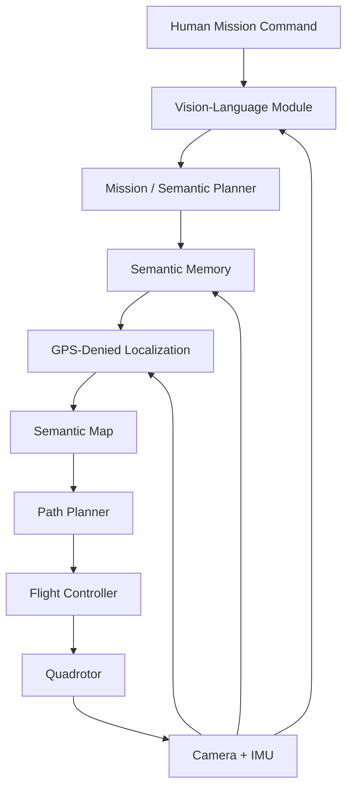
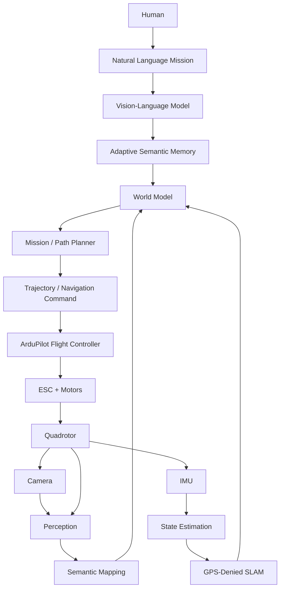

# Adaptive Semantic Memory for Vision-Language Autonomous UAV Navigation in GPS-Denied Environments

<div align="center">


</div>

<div align="center">

[](https://docs.ros.org/en/humble/)
[](https://gazebosim.org/)
[](https://ardupilot.org/)
[](https://www.python.org/)
[](https://pytorch.org/)
[](https://www.ros.org/)
[](LICENSE)

**Autonomous Aerial Robotics | Vision-Language Navigation | GPS-Denied Navigation | Semantic Memory**

</div>

---

## Team Members

| Name          | Roll Number      |
| ------------- | ---------------- |
| YOUR NAME     | YOUR ROLL NUMBER |
| TEAM MEMBER 2 | ROLL NUMBER      |
| TEAM MEMBER 3 | ROLL NUMBER      |
| TEAM MEMBER 4 | ROLL NUMBER      |

---

# Table of Contents

1. [Introduction & Motivation](#1-introduction--motivation)
2. [Problem Statement](#2-problem-statement)
3. [Research Gap](#3-research-gap)
4. [Project Objectives](#4-project-objectives)
5. [Core Research Question](#5-core-research-question)
6. [System Overview](#6-system-overview)
7. [Quadrotor Fundamentals](#7-quadrotor-fundamentals)
8. [Coordinate Frames & State Representation](#8-coordinate-frames--state-representation)
9. [Quaternion-Based Attitude Representation](#9-quaternion-based-attitude-representation)
10. [Quadrotor Dynamics](#10-quadrotor-dynamics)
11. [GPS-Denied Navigation](#11-gps-denied-navigation)
12. [Visual Odometry & SLAM](#12-visual-odometry--slam)
13. [State Estimation](#13-state-estimation)
14. [Semantic Mapping](#14-semantic-mapping)
15. [Vision-Language Navigation](#15-vision-language-navigation)
16. [Adaptive Semantic Memory](#16-adaptive-semantic-memory)
17. [Proposed Architecture](#17-proposed-architecture)
18. [Simulation Environment](#18-simulation-environment)
19. [Software Stack](#19-software-stack)
20. [Hardware Architecture](#20-hardware-architecture)
21. [Raspberry Pi Deployment](#21-raspberry-pi-deployment)
22. [Simulation-to-Real Transfer](#22-simulation-to-real-transfer)
23. [5–7 Month Project Roadmap](#23-57-month-project-roadmap)
24. [Experimental Methodology](#24-experimental-methodology)
25. [Baselines](#25-baselines)
26. [Evaluation Metrics](#26-evaluation-metrics)
27. [Ablation Studies](#27-ablation-studies)
28. [Expected Results](#28-expected-results)
29. [Real-World Demonstration](#29-real-world-demonstration)
30. [Limitations](#30-limitations)
31. [Future Work](#31-future-work)
32. [Repository Structure](#32-repository-structure)
33. [Execution & Platform Information](#33-execution--platform-information)
34. [Reproducibility](#34-reproducibility)
35. [References](#35-references)
36. [Conclusion](#36-conclusion)

---

# 1. Introduction & Motivation

Autonomous drones have progressed from remotely controlled aerial platforms to increasingly capable robotic systems that can perceive, localize, plan, and act in complex environments.

However, most practical autonomous UAV systems still rely heavily on:

* GPS or external localization infrastructure
* predefined waypoints
* geometric maps
* fixed object classes
* short-horizon planning
* stateless perception

These assumptions break down in environments such as:

* disaster zones
* collapsed buildings
* warehouses
* underground environments
* tunnels
* mines
* forests
* large indoor facilities

A human search-and-rescue operator does not navigate such environments using latitude and longitude alone.

Humans combine:

**visual perception + spatial understanding + memory + language + reasoning + action.**

This project investigates whether a UAV can be given a similar high-level capability.

The proposed system combines:

```text
GPS-Denied Localization
        +
Semantic Mapping
        +
Vision-Language Understanding
        +
Adaptive Semantic Memory
        +
Autonomous Planning
        +
Low-Level Flight Control
```

The long-term goal is a UAV capable of understanding natural-language mission instructions, navigating without GPS, building a semantic representation of its environment, remembering important observations, and using those memories during subsequent decisions.

---

# 2. Problem Statement

Consider the following instruction:

> "Search the second floor for a person wearing a yellow jacket near an emergency exit."

A conventional waypoint-based UAV cannot directly execute this instruction.

The instruction contains several layers of meaning:

```text
"second floor"
        ↓
Spatial localization

"person"
        ↓
Object understanding

"yellow jacket"
        ↓
Visual-language grounding

"near"
        ↓
Spatial reasoning

"emergency exit"
        ↓
Semantic understanding

"search"
        ↓
Exploration + planning
```

The UAV therefore needs to solve several problems simultaneously.

### Core challenges

1. **GPS-denied localization**
2. **3D mapping**
3. **Visual perception**
4. **Language grounding**
5. **Spatial reasoning**
6. **Semantic representation**
7. **Long-horizon memory**
8. **Autonomous planning**
9. **Flight control**
10. **Limited onboard computation**

The central research problem is:

> **How can an autonomous UAV maintain and exploit useful semantic memories to improve long-horizon vision-language navigation in GPS-denied environments?**

---

# 3. Research Gap

GPS-denied navigation itself is not a new problem.

Similarly, VLMs, SLAM, object detection, and autonomous flight all have substantial existing literature.

The research opportunity lies in their interaction.

A conventional navigation system can be represented as:

```text
Observe
   ↓
Localize
   ↓
Plan
   ↓
Act
```

A VLM-based system may extend this to:

```text
Language
   ↓
Vision-Language Reasoning
   ↓
Plan
   ↓
Act
```

However, long-horizon missions introduce another requirement:

```text
What did I see earlier?
Where did I see it?
How confident was I?
Has the environment changed?
Is this observation still relevant?
Should I revisit it?
```

The proposed research investigates an additional layer:

```text
                 ┌─────────────────┐
                 │ Semantic Memory │
                 └────────┬────────┘
                          │
Observation → Reason → Retrieve → Update → Act
```

The proposed research direction is therefore:

> **Adaptive semantic memory for long-horizon autonomous UAV navigation.**

The memory system is not intended to store every camera frame indefinitely.

Instead, it should investigate:

* what information is worth storing,
* how memories should be represented,
* how memories should be retrieved,
* when memories should be updated,
* when memories should be discarded,
* and when uncertainty should trigger re-observation.

---

# 4. Project Objectives

## Primary Objective

Develop a UAV capable of performing natural-language-guided autonomous missions in GPS-denied environments using semantic perception and adaptive memory.

## Secondary Objectives

* Develop a realistic quadrotor simulation.
* Integrate ArduPilot Software-in-the-Loop (SITL).
* Implement GPS-denied localization.
* Build a semantic map of the environment.
* Ground natural-language commands into visual targets.
* Develop a semantic memory representation.
* Implement adaptive memory retrieval.
* Evaluate long-horizon navigation.
* Deploy a lightweight version on Raspberry Pi.
* Demonstrate the system on a physical UAV.

---

# 5. Core Research Question

### Main Question

> **Can adaptive semantic memory improve long-horizon vision-language navigation for UAVs operating without GPS?**

### Sub-questions

1. Does memory improve mission completion rate?
2. Does memory reduce repeated exploration?
3. Can semantic memories be retrieved using natural language?
4. Can the UAV distinguish useful memories from irrelevant observations?
5. How does memory affect navigation time?
6. How robust is memory when the environment changes?
7. How much computational overhead does the memory system introduce?
8. Can a lightweight version operate on an edge computer such as a Raspberry Pi?

---

# 6. System Overview

The proposed system contains four major layers:



The system is deliberately modular.

The VLM is responsible for high-level understanding.

The localization system estimates where the UAV is.

The planner decides where to go.

The flight controller is responsible for stabilizing and flying the UAV.

---

# 7. Quadrotor Fundamentals

The UAV is modeled as a quadrotor with four independently controlled rotors.

Each rotor generates thrust approximately proportional to the square of its angular velocity:

$$
T_i = k_f \omega_i^2
$$

where:

* $T_i$ = thrust generated by rotor $i$
* $k_f$ = thrust coefficient
* $\omega_i$ = rotor angular velocity

The total thrust is:

$$
T = \sum_{i=1}^{4} T_i
$$

The four rotor speeds control:

* collective thrust
* roll
* pitch
* yaw

The quadrotor has:

### Translational DOF

$$
x,\ y,\ z
$$

### Rotational DOF

$$
\phi,\ \theta,\ \psi
$$

where:

* $\phi$ = roll
* $\theta$ = pitch
* $\psi$ = yaw

Therefore:

> **6 degrees of freedom are controlled using 4 independent actuator inputs.**

This makes the quadrotor an **underactuated system**.

---

# 8. Coordinate Frames & State Representation

The system uses multiple coordinate frames.

## World Frame

A fixed inertial reference frame.

```text
             Z
             ↑
             |
             |
             └────────→ X
            /
           /
          Y
```

## Body Frame

Attached to the UAV.

```text
          Forward
             ↑
             |
      Left ← UAV → Right
             |
```

The transformation between frames is essential for:

* localization
* trajectory generation
* sensor fusion
* control
* SLAM
* camera projection

A typical state representation is:

$$
\mathbf{x} =
\begin{bmatrix}
\mathbf{p} \
\mathbf{v} \
\mathbf{q} \
\boldsymbol{\omega}
\end{bmatrix}
$$

where:

* $\mathbf{p}$ = position
* $\mathbf{v}$ = velocity
* $\mathbf{q}$ = orientation quaternion
* $\boldsymbol{\omega}$ = angular velocity

---

# 9. Quaternion-Based Attitude Representation

Euler angles are intuitive but suffer from singularities such as gimbal lock.

The project therefore uses quaternion-based attitude representation where appropriate.

A quaternion is:

$$
q =
\begin{bmatrix}
q_w & q_x & q_y & q_z
\end{bmatrix}^T
$$

with:

$$
|q| = 1
$$

A quaternion can represent 3D orientation without the singularities associated with Euler-angle representations.

Quaternion operations are important for:

* IMU integration
* attitude estimation
* coordinate transformations
* trajectory representation
* flight control
* ROS message interfaces

The quaternion derivative can be expressed as:

$$
\dot{q}
=======

\frac{1}{2}
\Omega(\omega)q
$$

where $\Omega(\omega)$ represents the angular-velocity matrix.

Quaternion normalization is periodically applied to avoid numerical drift:

$$
q \leftarrow \frac{q}{|q|}
$$

---

# 10. Quadrotor Dynamics

The translational dynamics can be represented using Newton's second law:

$$
m\ddot{\mathbf{p}}
==================

m\mathbf{g}
+
R(q)\mathbf{T}
+
\mathbf{F}_{ext}
$$

where:

* $m$ = UAV mass
* $\mathbf{g}$ = gravitational acceleration
* $R(q)$ = rotation matrix corresponding to quaternion $q$
* $\mathbf{T}$ = thrust vector
* $\mathbf{F}_{ext}$ = external forces such as drag or disturbances

The rotational dynamics follow the rigid-body equation:

$$
J\dot{\boldsymbol{\omega}}
+
\boldsymbol{\omega}
\times
J\boldsymbol{\omega}
====================

\boldsymbol{\tau}
$$

where:

* $J$ = inertia matrix
* $\boldsymbol{\omega}$ = angular velocity
* $\boldsymbol{\tau}$ = control torque

These equations form the physical foundation of the simulated UAV.

---

# 11. GPS-Denied Navigation

The GPS-denied subsystem is the foundation of the project.

GPS is deliberately unavailable during the main navigation experiments.

The UAV instead estimates its state from onboard sensors.

```text
Camera
   +
IMU
   ↓
Visual-Inertial Odometry
   ↓
Pose Estimation
   ↓
SLAM / Mapping
   ↓
State Estimate
   ↓
Navigation
```

This allows the UAV to operate in environments where GPS is unavailable or unreliable.

Example environments:

* indoor buildings
* warehouses
* corridors
* tunnels
* underground environments
* disaster-response environments

---

# 12. Visual Odometry & SLAM

The UAV's camera provides image observations while the IMU provides:

* linear acceleration
* angular velocity

These measurements are combined to estimate motion.

A SLAM system simultaneously estimates:

$$
\text{Pose} + \text{Map}
$$

The initial implementation will use an existing SLAM/VIO framework rather than attempting to develop a complete SLAM system from scratch.

Candidate systems include:

* ORB-SLAM3
* RTAB-Map
* visual-inertial odometry frameworks

The selected system will depend on simulation compatibility and onboard computational requirements.

---

## Geometric Map

The geometric map represents:

* walls
* obstacles
* free space
* occupied space
* camera trajectory

Example:

```text
+----------------------+
|                      |
|    Room A            |
|                      |
|       +------+       |
|       |      |       |
|       |Room B|       |
|       |      |       |
|       +------+       |
|                      |
+----------------------+
```

---

# 13. State Estimation

The sensors do not directly provide perfect state information.

Sensor measurements contain:

* noise
* bias
* drift
* latency

Therefore state estimation is required.

A simplified state-estimation pipeline is:

```text
IMU ──────────────┐
                  ↓
Camera → VIO → EKF → State Estimate
                  ↑
                  │
              Other Sensors
```

The Extended Kalman Filter can be represented conceptually as:

### Prediction

$$
\hat{x}_{k|k-1}
===============

f(\hat{x}_{k-1|k-1},u_k)
$$

### Measurement Update

$$
\hat{x}_{k|k}
=============

\hat{x}*{k|k-1}
+
K_k
(z_k-h(\hat{x}*{k|k-1}))
$$

where $K_k$ is the Kalman gain.

---

# 14. Semantic Mapping

Traditional SLAM provides geometric information.

Our system additionally associates semantic information with spatial locations.

Instead of:

```text
Point Cloud
```

the system attempts to build:

```text
Semantic World Model

Room 101
 ├── Door
 ├── Emergency Exit
 ├── Person
 └── Backpack

Room 102
 ├── Staircase
 ├── Fire Extinguisher
 └── Person
```

Each semantic observation may contain:

```text
Object:
    class
    position
    timestamp
    confidence
    visual features
    semantic relationships
```

This representation becomes the basis for the memory subsystem.

---

# 15. Vision-Language Navigation

The UAV receives a natural-language mission.

Example:

> "Find the red backpack near the emergency exit."

The VLM receives:

* image observations
* language instruction
* optionally semantic map information

and produces high-level semantic information.

```text
Language
   +
Image
   ↓
Vision-Language Model
   ↓
Target / Relationship
   ↓
Mission Planner
```

Potential models for experimentation include:

* SmolVLM
* Qwen-VL family
* Florence-family vision-language models

The project does **not** require training a foundation VLM from scratch.

The research focus is on how a VLM can be integrated with autonomous aerial navigation.

---

# 16. Adaptive Semantic Memory

This is the central research component.

A naive system could store every observation:

```text
Frame 1
Frame 2
Frame 3
...
Frame N
```

This quickly becomes inefficient.

Instead, the proposed system stores structured semantic memories.

Example:

```text
Memory ID: M_023

Object: Person
Description: Person wearing yellow jacket
Location: Room 204
Position: (x, y, z)
Confidence: 0.91
Timestamp: 14:32
Mission: Search-01
Status: Unverified
Importance: High
```

---

## Memory Lifecycle


---

## Memory Selection

The system investigates whether memory importance can depend on:

$$
I =
w_1C
+
w_2R
+
w_3S
+
w_4U
$$

where:

* $C$ = confidence
* $R$ = relevance to current mission
* $S$ = semantic significance
* $U$ = uncertainty / expected information value
* $w_i$ = weighting coefficients

This formulation is a starting point for experimentation rather than a fixed final algorithm.

---

## Memory Retrieval

When the operator asks:

> "Go back to the person you found earlier."

the system searches semantic memory.

```text
Language Query
      ↓
Semantic Retrieval
      ↓
Candidate Memories
      ↓
Spatial Verification
      ↓
Navigation Goal
```

---

## Memory Updating

The environment can change.

For example:

```text
t1:
Room 203 → Backpack

t2:
Backpack removed

t3:
New observation → no backpack
```

The memory system should therefore distinguish between:

* old observation
* current observation
* confidence
* temporal validity

---

# 17. Proposed Architecture

The complete system can be represented as:



---

# 18. Simulation Environment

Simulation is the primary development environment.

The project is intentionally designed around:

> **Simulation → Validation → Hardware → Sim-to-Real Evaluation**

The first version of the complete system should be functional before attempting real flight.

---

## 18.1 Gazebo

Gazebo provides the physical simulation environment.

The simulated UAV includes:

* rigid-body dynamics
* gravity
* collisions
* motors
* camera
* IMU
* environment geometry

Example:

```text
Gazebo World
     |
     +-- Quadrotor
     |
     +-- RGB Camera
     |
     +-- IMU
     |
     +-- Obstacles
     |
     +-- Building
```

---

## 18.2 ArduPilot SITL

ArduPilot SITL provides the software equivalent of the real flight controller.

The architecture becomes:

```text
Gazebo
  ↓
Simulated Physics
  ↓
ArduPilot SITL
  ↓
Virtual Flight Controller
  ↓
ROS2 / MAVLink
```

The goal is to make the simulation architecture resemble the physical system.

---

## 18.3 ROS 2

ROS 2 provides the communication layer between:

* perception
* SLAM
* memory
* planning
* flight control

Example topics:

```text
/camera/image_raw
/imu/data
/tf
/odom
/scan
/semantic_objects
/memory/query
/memory/retrieval
/cmd_vel
```

Exact topic names may change depending on the final implementation.

---

# 19. Software Stack

| Layer              | Technology                                    |
| ------------------ | --------------------------------------------- |
| Operating System   | Ubuntu Linux                                  |
| Middleware         | ROS 2                                         |
| Physics Simulator  | Gazebo                                        |
| Flight Stack       | ArduPilot                                     |
| Simulation         | ArduPilot SITL                                |
| Communication      | MAVLink                                       |
| Vision             | OpenCV                                        |
| SLAM / VIO         | ORB-SLAM3 / RTAB-Map candidate                |
| Object Grounding   | Grounding DINO candidate                      |
| Segmentation       | SAM-family candidate                          |
| VLM                | SmolVLM / Qwen-VL / Florence-family candidate |
| Planning           | ROS 2 Nav2 / custom planner                   |
| Deep Learning      | PyTorch                                       |
| Hardware Compute   | Raspberry Pi                                  |
| Flight Controller  | Pixhawk-class controller                      |
| Programming        | Python + C++                                  |
| Experiment Logging | ROS bags + CSV/JSON                           |

---

# 20. Hardware Architecture

The physical UAV follows a two-computer architecture.

```text
                  Raspberry Pi
                ┌──────────────┐
Camera ────────→│ Perception   │
                │ VLM          │
                │ Memory       │
                │ Planning     │
                └──────┬───────┘
                       │
                    MAVLink
                       │
                       ↓
                ┌──────────────┐
                │   Pixhawk    │
                │              │
                │ Stabilization│
                │ State Control│
                │ Safety       │
                └──────┬───────┘
                       │
                  Motor Outputs
                       │
             ┌─────────┼─────────┐
             ↓         ↓         ↓
            ESC       ESC       ESC ...
             ↓         ↓         ↓
           Motor     Motor     Motor
```

---

## Hardware Components

| Component               | Role                       |
| ----------------------- | -------------------------- |
| Raspberry Pi            | Companion computer         |
| Pixhawk-class FC        | Real-time flight control   |
| Quadrotor frame         | Mechanical structure       |
| Brushless motors        | Propulsion                 |
| ESC                     | Motor control              |
| LiPo battery            | Power                      |
| Propellers              | Thrust generation          |
| Camera                  | Visual perception          |
| IMU                     | Motion sensing             |
| RC transmitter/receiver | Manual override and safety |
| Optional depth camera   | Depth / VIO experiments    |

---

# 21. Raspberry Pi Deployment

The Raspberry Pi is not responsible for high-frequency motor stabilization.

Instead:

```text
Raspberry Pi
     ↓
High-level autonomy
     ↓
MAVLink
     ↓
Pixhawk
     ↓
Low-level control
     ↓
Motors
```

This separation is critical.

The flight controller handles time-critical stabilization.

The Raspberry Pi handles computationally heavier tasks such as:

* semantic perception
* VLM inference
* memory retrieval
* mission planning
* navigation commands

---

## Edge Deployment Strategy

Large models will initially run on a development computer.

The deployment pipeline is:

```text
Research PC / GPU
       ↓
Model Evaluation
       ↓
Model Compression
       ↓
Quantization / Optimization
       ↓
Raspberry Pi
       ↓
Real UAV
```

The final onboard model will be selected based on:

* accuracy
* latency
* RAM usage
* CPU utilization
* power consumption

---

# 22. Simulation-to-Real Transfer

The simulator is not expected to perfectly reproduce reality.

Differences include:

* camera noise
* motion blur
* lighting
* sensor latency
* IMU bias
* vibration
* motor response
* mass distribution
* aerodynamic effects

Therefore, simulation experiments should include controlled randomization.

Potential randomized variables:

```text
Camera exposure
Camera noise
IMU noise
IMU bias
Mass
Motor response
Lighting
Texture
Wind
Sensor latency
```

The objective is to prevent the autonomy stack from depending on unrealistic simulation conditions.

---

# 23. 5–7 Month Project Roadmap

## Phase 0 — Foundations

### Duration: Weeks 1–2

Study:

* quadrotor anatomy
* 6-DOF dynamics
* coordinate frames
* quaternions
* PID basics
* IMU
* MAVLink
* ROS 2 fundamentals

### Deliverable

A working understanding of the complete UAV stack.

---

# Phase 1 — Simulation Platform

### Duration: Weeks 2–4

Set up:

* Ubuntu
* ROS 2
* Gazebo
* ArduPilot SITL
* MAVLink

Create:

* simulated quadrotor
* camera
* IMU
* indoor environment

### Deliverable

The UAV can:

* arm
* take off
* hover
* land
* execute basic navigation commands

---

# Phase 2 — GPS-Denied Navigation

### Duration: Weeks 4–7

Implement:

* visual odometry
* SLAM / VIO
* coordinate transformations
* state estimation
* GPS-disabled navigation

### Deliverable

The UAV can navigate through a simulated indoor environment without GPS.

---

# Phase 3 — Semantic Perception

### Duration: Weeks 7–10

Implement:

* object detection / grounding
* semantic labels
* spatial localization
* semantic map representation

Example:

```text
Person
   ↓
Room 203
   ↓
Position (x,y,z)
   ↓
Confidence 0.92
```

### Deliverable

The UAV can build a semantic representation of its environment.

---

# Phase 4 — Vision-Language Navigation

### Duration: Weeks 10–13

Add:

* VLM
* natural-language mission commands
* target grounding
* semantic planning

Example:

```text
"Find the red backpack."

        ↓

VLM

        ↓

Target = backpack
Color = red

        ↓

Semantic Search

        ↓

Navigation Goal
```

### Deliverable

The UAV can execute basic natural-language navigation tasks in simulation.

---

# Phase 5 — Semantic Memory

### Duration: Weeks 13–16

Develop:

* memory representation
* memory database
* semantic retrieval
* spatial retrieval
* temporal information
* confidence tracking

### Deliverable

The UAV can remember previously observed objects and locations.

---

# Phase 6 — Adaptive Memory

### Duration: Weeks 16–20

This is the main research phase.

Investigate:

* memory importance
* memory compression
* retrieval policies
* confidence
* memory updating
* forgetting
* uncertainty-driven revisits

Compare:

```text
Baseline:
No persistent memory
```

against:

```text
Baseline:
Always store memory
```

and:

```text
Proposed:
Adaptive semantic memory
```

### Deliverable

Experimental evidence showing whether adaptive memory improves long-horizon navigation.

---

# Phase 7 — Robustness & Evaluation

### Duration: Weeks 20–23

Test:

* different environments
* different mission lengths
* different object densities
* sensor noise
* lighting changes
* dynamic objects
* memory size constraints

Run:

* ablation studies
* baseline comparisons
* statistical evaluation

### Deliverable

Final experimental dataset and plots.

---

# Phase 8 — Real UAV

### Duration: Weeks 22–26

Transfer validated modules to:

* Raspberry Pi
* Pixhawk
* camera
* physical UAV

Begin with:

```text
Bench test
   ↓
Props-off test
   ↓
Tethered test
   ↓
Manual flight
   ↓
Assisted autonomy
   ↓
Controlled autonomous test
```

### Deliverable

Physical UAV demonstration.

---

# Phase 9 — Paper & Final Demonstration

### Duration: Weeks 26–28

Prepare:

* final experiments
* figures
* architecture diagrams
* videos
* paper
* documentation

Potential targets:

* ICRA
* IROS
* IEEE RA-L
* relevant robotics workshops

Acceptance is not guaranteed; the publication target depends on the eventual novelty and experimental strength.

---

# 24. Experimental Methodology

Experiments will be performed in progressively more difficult environments.

## Environment A — Static Indoor

Simple rooms and corridors.

Purpose:

Validate localization and navigation.

---

## Environment B — Semantic Indoor

Objects are introduced.

Examples:

* backpacks
* doors
* people
* emergency signs
* fire extinguishers

Purpose:

Validate semantic perception.

---

## Environment C — Long-Horizon Missions

Multiple rooms and targets.

Purpose:

Test memory.

---

## Environment D — Dynamic Environment

Objects and people move.

Purpose:

Test memory updates and stale information.

---

## Environment E — Noisy Environment

Introduce:

* sensor noise
* lighting variation
* motion blur
* localization uncertainty

Purpose:

Test robustness.

---

# 25. Baselines

The proposed method must be compared against meaningful baselines.

## Baseline 1 — No Memory

```text
Observe
 ↓
Reason
 ↓
Act
```

No persistent semantic memory.

---

## Baseline 2 — Full Memory

Store every semantic observation.

This tests whether simply adding memory is sufficient.

---

## Baseline 3 — Static Semantic Memory

Store important observations using fixed thresholds.

---

## Proposed Method

```text
Adaptive Semantic Memory
```

The proposed method dynamically determines:

* what to store
* what to update
* what to retrieve
* what to discard

---

# 26. Evaluation Metrics

## Navigation Success Rate

$$
SR =
\frac{N_{successful}}
{N_{total}}
$$

---

## Mission Completion Rate

Percentage of complete missions successfully executed.

---

## Navigation Time

Total time required to complete the mission.

---

## Path Length

$$
L =
\sum_{i=1}^{N-1}
|\mathbf{p}_{i+1}-\mathbf{p}_i|
$$

---

## Memory Retrieval Accuracy

Percentage of queries where the correct memory is retrieved.

---

## Re-exploration Rate

Measures how often the UAV unnecessarily revisits previously explored regions.

---

## Memory Efficiency

Measure the relationship between:

```text
Mission Performance
        /
Memory Size
```

---

## Computational Cost

Measure:

* RAM
* CPU utilization
* inference latency
* memory retrieval latency

---

## Energy

For physical experiments:

$$
E = \int P(t),dt
$$

where $P(t)$ is UAV electrical power.

---

# 27. Ablation Studies

A research paper should not only show that the system works.

It should show **why** it works.

---

## Ablation A — Memory Disabled

```text
VLM + Navigation
```

vs

```text
VLM + Navigation + Memory
```

---

## Ablation B — Adaptive Selection Disabled

Compare:

```text
Store Everything
```

vs

```text
Adaptive Storage
```

---

## Ablation C — Confidence Disabled

Compare:

```text
Memory without confidence
```

vs

```text
Confidence-aware memory
```

---

## Ablation D — Temporal Information Disabled

Compare:

```text
Static memories
```

vs

```text
Time-aware memories
```

---

## Ablation E — Dynamic Environment

Compare performance when:

* objects remain static
* objects move
* previously observed information becomes stale

---

# 28. Expected Results

The project hypothesis is:

> **Adaptive semantic memory should improve long-horizon navigation efficiency and task completion compared with stateless or naive-memory baselines, particularly when missions require revisiting previously observed locations.**

Expected trends:

| Metric                   | No Memory | Full Memory |  Adaptive Memory |
| ------------------------ | --------: | ----------: | ---------------: |
| Mission Success          |  Baseline |    Improved |         Improved |
| Re-exploration           |      High |      Medium |            Lower |
| Memory Usage             |       Low |        High |       Controlled |
| Retrieval Accuracy       |       N/A |      Medium |             High |
| Long-Horizon Performance |     Lower |    Improved | Highest expected |
| Compute Cost             |       Low |        High |       Controlled |

These are **hypotheses**, not claimed experimental results.

Actual values will only be reported after experiments.

---

# 29. Real-World Demonstration

The final physical demonstration should be intentionally constrained.

The first target environment should be:

> **A controlled indoor environment with known safety boundaries and no public airspace exposure.**

Example mission:

```text
Operator:

"Find the red backpack."

        ↓

VLM

        ↓

Semantic target

        ↓

GPS-denied localization

        ↓

Explore

        ↓

Backpack detected

        ↓

Store memory

        ↓

Mission complete
```

Then:

```text
Operator:

"Go back to the backpack."

        ↓

Semantic Memory Retrieval

        ↓

Retrieve location

        ↓

Verify current environment

        ↓

Navigate

        ↓

Return
```

The second mission is the key demonstration.

It shows the difference between:

> **seeing something**

and

> **remembering something useful for future action.**

---

# 30. Limitations

This project has several important limitations.

### 1. VLM inference

Large VLMs may not run efficiently on Raspberry Pi-class hardware.

Therefore, model selection and optimization are part of deployment.

---

### 2. SLAM failures

Visual localization can degrade due to:

* textureless surfaces
* rapid motion
* lighting changes
* motion blur
* repeated structures

---

### 3. Simulation gap

A simulated environment cannot perfectly reproduce:

* aerodynamic effects
* vibration
* camera artifacts
* sensor latency
* real-world lighting

---

### 4. Memory errors

Incorrect semantic observations can create incorrect memories.

Therefore, confidence and verification are important.

---

### 5. Safety

The physical UAV will initially operate under human supervision and controlled conditions.

The research system should never override fundamental flight-controller safety mechanisms.

---

# 31. Future Work

Potential extensions include:

### Multi-UAV Shared Memory

```text
Drone A
   ↓
Shared Semantic Memory
   ↑
Drone B
```

---

### Energy-Aware Memory

The UAV could prioritize memories that are likely to reduce future flight distance.

---

### Uncertainty-Aware Navigation

If the UAV is uncertain about a memory, it can deliberately revisit the location.

---

### Learned Memory Policies

Instead of hand-designed memory importance:

```text
Observation
   ↓
Learned Memory Policy
   ↓
Store / Forget / Update
```

---

### Vision-Language-Action Models

Move from:

```text
Language
 ↓
Planning
 ↓
Controller
```

toward models capable of directly learning the relationship between perception, language, and action.

---

### Multi-Agent Search & Rescue

Multiple UAVs could share semantic observations and coordinate exploration.

---

# 32. Repository Structure

```text
adaptive-semantic-uav/
│
├── assets/
│   ├── drone_logo.png
│   ├── system_architecture.png
│   ├── simulation_environment.png
│   ├── semantic_map.png
│   └── memory_pipeline.png
│
├── 00_base_papers/
│   ├── quadrotor_dynamics/
│   ├── gps_denied_navigation/
│   ├── slam/
│   ├── vision_language_navigation/
│   └── semantic_memory/
│
├── 01_docs/
│   ├── project_proposal/
│   ├── literature_review/
│   ├── experiment_logs/
│   ├── presentations/
│   └── research_notes/
│
├── 02_simulation/
│   ├── gazebo/
│   │   ├── worlds/
│   │   ├── models/
│   │   └── launch/
│   │
│   ├── ardupilot_sitl/
│   └── configs/
│
├── 03_ros2/
│   ├── perception/
│   ├── localization/
│   ├── semantic_mapping/
│   ├── navigation/
│   ├── memory/
│   ├── planner/
│   └── interfaces/
│
├── 04_vision_language/
│   ├── vlm/
│   ├── grounding/
│   ├── segmentation/
│   └── prompts/
│
├── 05_memory/
│   ├── baseline/
│   ├── semantic_memory/
│   ├── adaptive_memory/
│   ├── retrieval/
│   └── evaluation/
│
├── 06_experiments/
│   ├── baseline/
│   ├── ablations/
│   ├── dynamic_environment/
│   ├── noisy_environment/
│   └── long_horizon/
│
├── 07_hardware/
│   ├── pixhawk/
│   ├── raspberry_pi/
│   ├── camera/
│   ├── calibration/
│   └── flight_tests/
│
├── 08_results/
│   ├── logs/
│   ├── plots/
│   ├── tables/
│   └── videos/
│
├── 09_paper/
│   ├── figures/
│   ├── tables/
│   └── manuscript/
│
├── requirements.txt
├── environment.yml
├── LICENSE
└── README.md
```

---

# 33. Execution & Platform Information

## Simulation Development

| Component        | Platform             |
| ---------------- | -------------------- |
| Operating System | Ubuntu Linux         |
| ROS 2            | Humble               |
| Simulator        | Gazebo               |
| Flight Stack     | ArduPilot SITL       |
| Development      | Python / C++         |
| Deep Learning    | PyTorch              |
| Main Compute     | Development PC / GPU |

---

## Edge Deployment

| Component          | Platform                        |
| ------------------ | ------------------------------- |
| Companion Computer | Raspberry Pi                    |
| Flight Controller  | Pixhawk-class FC                |
| Communication      | MAVLink                         |
| Camera             | USB / compatible onboard camera |
| Flight Environment | Controlled indoor environment   |

---

## Performance Logging

Each experiment should record:

```text
Experiment ID
Environment
Mission
Seed
Initial Pose
Target
Mission Success
Flight Time
Path Length
Memory Size
Memory Retrieval Accuracy
Inference Latency
CPU Usage
RAM Usage
Battery / Energy
Failures
```

This makes the experiments reproducible.

---

# 34. Reproducibility

Each experiment should specify:

* random seed
* environment version
* model version
* VLM configuration
* planner parameters
* memory parameters
* sensor noise configuration
* simulation world
* initial UAV pose
* mission instruction

Example:

```text
experiment:
    id: exp_023

environment:
    world: indoor_search_v3

seed:
    42

mission:
    "Find the red backpack near the emergency exit."

memory:
    mode: adaptive
    max_entries: 100

navigation:
    gps: disabled

perception:
    model: <selected_model>

evaluation:
    success: true
```

The goal is to make every reported result independently reproducible.

---

# 35. References

The project literature should be maintained in:

```text
00_base_papers/
```

and updated throughout development.

## Core UAV / Robotics Foundations

1. **Modern Robotics: Mechanics, Planning, and Control**
   Kevin M. Lynch and Frank C. Park.

2. **Probabilistic Robotics**
   Sebastian Thrun, Wolfram Burgard, Dieter Fox.

3. **Multiple View Geometry in Computer Vision**
   Richard Hartley and Andrew Zisserman.

---

## Quadrotor Dynamics & Control

The uploaded quadrotor-control references should form the mathematical foundation of the project, particularly for:

* rigid-body dynamics
* quadrotor modeling
* coordinate frames
* attitude representation
* control synthesis
* state-space modeling

The repository should store these papers under:

```text
00_base_papers/quadrotor_dynamics/
```

---

## SLAM / Visual-Inertial Navigation

4. **ORB-SLAM3: An Accurate Open-Source Library for Visual, Visual-Inertial and Multi-Map SLAM**
   Campos et al.

5. **RTAB-Map: Real-Time Appearance-Based Mapping**
   Labbé and Michaud.

---

## Vision-Language Foundation Models

6. **Learning Transferable Visual Models From Natural Language Supervision**
   Radford et al.

7. **Grounding DINO: Marrying DINO with Grounded Pre-Training for Open-Set Object Detection**

8. **Segment Anything**
   Kirillov et al.

---

## UAV Vision-Language Navigation

9. **Towards Realistic UAV Vision-Language Navigation: Platform, Benchmark, and Methodology**
   ICLR 2025.

This work provides an important foundation for realistic UAV vision-language navigation and motivates the separation between high-level semantic reasoning and low-level UAV navigation.

---

## Embodied AI / Memory

The literature review will additionally track recent work in:

* Vision-Language Navigation
* Vision-Language-Action models
* semantic memory
* episodic memory
* long-horizon embodied agents
* semantic mapping
* spatial reasoning
* autonomous aerial navigation

These references should be updated as the research progresses rather than freezing the bibliography at project start.

---

# 36. Conclusion

This project investigates a complete autonomous aerial robotics pipeline:

```text
                 Human
                   │
                   ▼
          Natural Language
                   │
                   ▼
        Vision-Language Model
                   │
                   ▼
        Adaptive Semantic Memory
                   │
          ┌────────┴────────┐
          ▼                 ▼
     Semantic Map       GPS-Denied SLAM
          │                 │
          └────────┬────────┘
                   ▼
             Path Planner
                   │
                   ▼
            Flight Controller
                   │
                   ▼
               Quadrotor
                   │
             ┌─────┴─────┐
             ▼           ▼
          Camera        IMU
             │           │
             └─────┬─────┘
                   ▼
             World Model
                   │
                   └──────────→ Memory
```

The project is intentionally structured from the bottom up.

First, the UAV must **fly**.

Then it must **localize without GPS**.

Then it must **perceive the environment**.

Then it must **understand language**.

Then it must **remember**.

Finally, it must use that memory to make better decisions over long-horizon missions.

The central research hypothesis is:

> **An adaptive semantic memory mechanism can improve long-horizon vision-language navigation for UAVs operating in GPS-denied environments by reducing unnecessary re-exploration, improving semantic retrieval, and enabling the UAV to exploit information acquired earlier in a mission.**

The physical UAV is therefore not the research contribution by itself.

The research contribution is the **adaptive memory and navigation framework**, validated first in simulation and subsequently on a real UAV.

---

<div align="center">

### From pixels → to perception → to memory → to reasoning → to autonomous flight.

**Adaptive Semantic Memory for Vision-Language Autonomous UAV Navigation**

</div>
