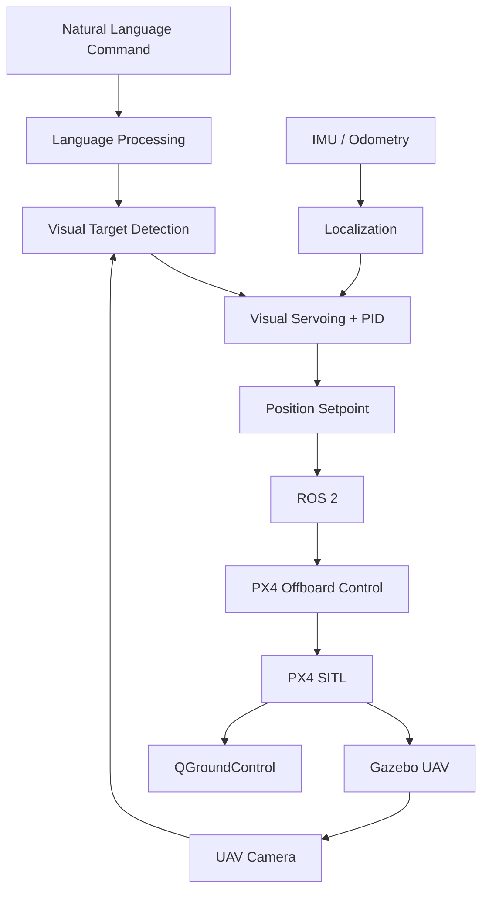

<div align="center">


# Vision-Language UAV Navigation for GPS-Denied Environments

### Vision-Language Navigation | UAV | Computer Vision | GPS-Denied Navigation | ROS 2 | PX4 | Gazebo

</div>

---

## Team Members

| S. No. | Name | Roll Number | Email |
|---|---|---|---|
| 1 | JENISHAA BHARATHI M | CB.SC.U4AIE24221 | cb.sc.u4aie24221@cb.students.amrita.edu |
| 2 | NAVEEN K | CB.SC.U4AIE24235 | cb.sc.u4aie24235@cb.students.amrita.edu |
| 3 | POOJA N | CB.SC.U4AIE24242 | cb.sc.u4aie24242@cb.students.amrita.edu |
| 4 | PRANESH M | CB.SC.U4AIE24345 | cb.sc.u4aie24345@cb.students.amrita.edu |
| 5 | SANDHIYA D | CB.SC.U4AIE24353 | cb.sc.u4aie24353@cb.students.amrita.edu |

---

# Abstract

Unmanned Aerial Vehicles (UAVs) traditionally rely on predefined GPS waypoints or precise manual control, limiting their flexibility in dynamic environments. This project introduces a **Vision-Language Navigation framework** that enables autonomous drones to understand and execute natural language navigation commands. By combining computer vision with natural language processing, the system interprets instructions such as **"Navigate past the blue sign and stop near the door"**, processes live camera input, identifies relevant visual targets, and dynamically generates navigation commands.

The framework provides a modular foundation for developing, simulating, and testing intelligent aerial navigation systems in GPS-denied environments.

---

# Introduction

### Evolving Aerial Autonomy
UAVs are transitioning from manually operated aircraft to autonomous systems capable of navigating complex and unpredictable environments.

### Visual Perception Challenge
Real-time interpretation of camera data and rapid flight adjustment remain major challenges in autonomous aerial navigation.

### Integrated ROS 2 Architecture
This project combines computer vision with a modular **ROS 2 flight-control architecture** for visual target tracking and autonomous navigation.

### Simulation
**Gazebo and PyBullet** provide realistic physics, sensor data, and camera simulation for safe testing without physical hardware.

### PX4 Integration
**PX4** provides flight stabilization, telemetry, waypoint management, and low-level control required for autonomous UAV operation.

---

# Methodology

The system combines the following core modules:

- **PyBullet + gym-pybullet-drones:** UAV, camera, physics, and target-tracking simulation.
- **OpenCV:** Camera processing and visual target detection.
- **Visual Servoing + PID:** Converts image-space target errors into UAV motion commands.
- **ROS 2:** Communication layer connecting perception, localization, and flight control.
- **PX4 SITL + Gazebo:** Autonomous flight simulation and low-level control.
- **PX4 State Bridge:** Publishes UAV odometry and state to ROS 2.
- **NED–ENU + TF/Odometry:** Maintains consistent UAV coordinate frames.
- **PX4 Offboard Control:** Sends position setpoints to the UAV.
- **QGroundControl:** Provides telemetry and flight-state monitoring.

### Flight Sequence

```text
ARM → TAKEOFF → HOVER → WAYPOINT → RETURN → LAND
```

---

# System Architecture



---

# Toy Example

### Command

> **"Find the red building near the road and fly to it."**

### Language Interpretation

```text
Object    = Building
Attribute = Red
Relation  = Near Road
Action    = Navigate
```

### Target Detection

The camera image and language instruction are used to identify the target:

$$
B = Ground(I,L)
$$

where:

- $I$ = camera image
- $L$ = language instruction
- $B$ = detected target region

### Position Error

Suppose:

$$
P_{UAV}=(0,0,5)\;m
$$

$$
P_{target}=(10,8,5)\;m
$$

Then:

$$
e_p=P_{target}-P_{UAV}
=
\begin{bmatrix}
10\\
8\\
0
\end{bmatrix}m
$$

The distance to the target is:

$$
d=\sqrt{(10-0)^2+(8-0)^2+(5-5)^2}
$$

$$
d=\sqrt{164}\approx12.81\;m
$$

### Navigation

The UAV generates intermediate position setpoints:

```text
(0,0,5)
   ↓
(3,2,5)
   ↓
(6,5,5)
   ↓
(10,8,5)
```

A position setpoint is represented as:

$$
W_i=[x_i,y_i,z_i,\psi_i]
$$

The target is reached when:

$$
d < \epsilon
$$

where $\epsilon$ is the allowed position error.

---

# Project Objective

The objective is to develop a modular UAV navigation framework that combines **natural-language understanding, computer vision, localization, visual servoing, ROS 2, PX4, and simulation** to enable autonomous navigation in GPS-denied environments.

---

# References

- **PX4 Documentation:** https://docs.px4.io/
- **ROS 2 Documentation:** https://docs.ros.org/
- **Gazebo Documentation:** https://gazebosim.org/docs
- **QGroundControl Documentation:** https://docs.qgroundcontrol.com/
- **gym-pybullet-drones:** https://github.com/utiasDSL/gym-pybullet-drones
- **OpenCV Documentation:** https://docs.opencv.org/

### SDD / PAP References

- **SDD:** Software Design Document / System Design Document associated with the project.
- **PAP:** Project Approval/Proposal document associated with the project.

---

<div align="center">

### Amrita Vishwa Vidyapeetham

**Vision-Language UAV Navigation for GPS-Denied Environments**

</div>
