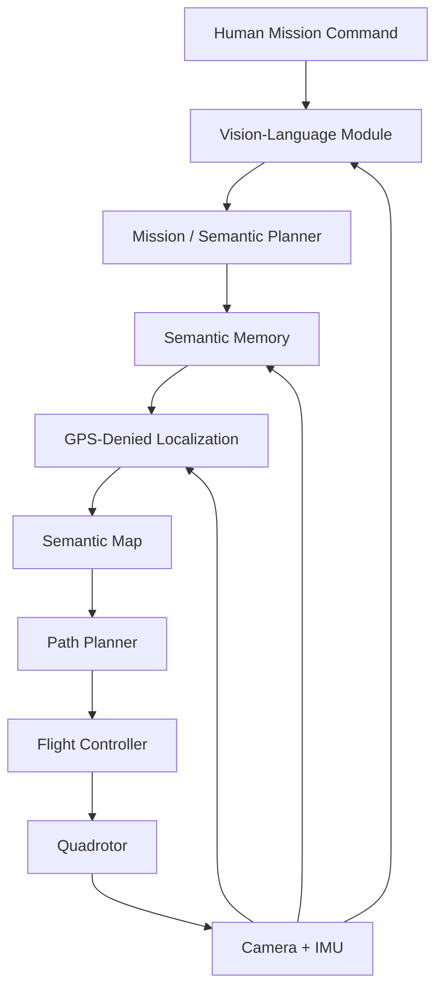
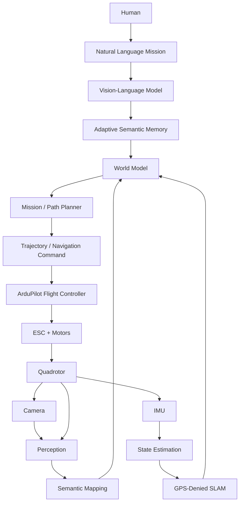

# Adaptive Semantic Memory for Vision-Language Autonomous UAV Navigation in GPS-Denied Environments

<div align="center">
</div>

<div align="center">

[](https://docs.ros.org/en/humble/)
[](https://gazebosim.org/)
[](https://ardupilot.org/)
[](https://www.python.org/)
[](https://pytorch.org/)
[](https://www.ros.org/)
[](LICENSE)

**Autonomous Aerial Robotics | Vision-Language Navigation | GPS-Denied Navigation | Semantic Memory**

</div>

---

## Team Members

| Name                | Roll Number      |
| ------------------- | ---------------- |
| PRANESH M           | CB.SC.U4AIE24345 |
| SANDHIYA D          | CB.SC.U4AIE24353 |
| JENISHAA BHARATHI M | CB.SC.U4AIE24221 |
| POOJA N             | CB.SC.U4AIE24242 |
| NAVEEN K            | CB.SC.U4AIE24235 |

---

# Table of Contents

1. [Introduction & Motivation](#1-introduction--motivation)
2. [Problem Statement](#2-problem-statement)
3. [Research Gap](#3-research-gap)
4. [Project Objectives](#4-project-objectives)
5. [Core Research Question](#5-core-research-question)
6. [System Overview](#6-system-overview)
7. [Quadrotor Fundamentals](#7-quadrotor-fundamentals)
8. [Coordinate Frames & State Representation](#8-coordinate-frames--state-representation)
9. [Quaternion-Based Attitude Representation](#9-quaternion-based-attitude-representation)
10. [Quadrotor Dynamics](#10-quadrotor-dynamics)
11. [GPS-Denied Navigation](#11-gps-denied-navigation)
12. [Visual Odometry & SLAM](#12-visual-odometry--slam)
13. [State Estimation](#13-state-estimation)
14. [Semantic Mapping](#14-semantic-mapping)
15. [Vision-Language Navigation](#15-vision-language-navigation)
16. [Adaptive Semantic Memory](#16-adaptive-semantic-memory)
17. [Proposed Architecture](#17-proposed-architecture)
18. [Simulation Environment](#18-simulation-environment)
19. [Software Stack](#19-software-stack)
20. [Hardware Architecture](#20-hardware-architecture)
21. [Raspberry Pi Deployment](#21-raspberry-pi-deployment)
22. [Simulation-to-Real Transfer](#22-simulation-to-real-transfer)
23. [5–7 Month Project Roadmap](#23-57-month-project-roadmap)
24. [Experimental Methodology](#24-experimental-methodology)
25. [Baselines](#25-baselines)
26. [Evaluation Metrics](#26-evaluation-metrics)
27. [Ablation Studies](#27-ablation-studies)
28. [Expected Results](#28-expected-results)
29. [Real-World Demonstration](#29-real-world-demonstration)
30. [Limitations](#30-limitations)
31. [Future Work](#31-future-work)
32. [Repository Structure](#32-repository-structure)
33. [Execution & Platform Information](#33-execution--platform-information)
34. [Reproducibility](#34-reproducibility)
35. [References](#35-references)
36. [Conclusion](#36-conclusion)

---

# 1. Introduction & Motivation

Autonomous drones have progressed from remotely controlled aerial platforms to increasingly capable robotic systems that can perceive, localize, plan, and act in complex environments.

However, most practical autonomous UAV systems still rely heavily on:

* GPS or external localization infrastructure
* predefined waypoints
* geometric maps
* fixed object classes
* short-horizon planning
* stateless perception

These assumptions break down in environments such as:

* disaster zones
* collapsed buildings
* warehouses
* underground environments
* tunnels
* mines
* forests
* large indoor facilities

A human search-and-rescue operator does not navigate such environments using latitude and longitude alone.

Humans combine:

**visual perception + spatial understanding + memory + language + reasoning + action.**

This project investigates whether a UAV can be given a similar high-level capability.

The proposed system combines:

```text
GPS-Denied Localization
        +
Semantic Mapping
        +
Vision-Language Understanding
        +
Adaptive Semantic Memory
        +
Autonomous Planning
        +
Low-Level Flight Control
```

The long-term goal is a UAV capable of understanding natural-language mission instructions, navigating without GPS, building a semantic representation of its environment, remembering important observations, and using those memories during subsequent decisions.

---

# 2. Problem Statement

Consider the following instruction:

> "Search the second floor for a person wearing a yellow jacket near an emergency exit."

A conventional waypoint-based UAV cannot directly execute this instruction.

The instruction contains several layers of meaning:

```text
"second floor"
        ↓
Spatial localization

"person"
        ↓
Object understanding

"yellow jacket"
        ↓
Visual-language grounding

"near"
        ↓
Spatial reasoning

"emergency exit"
        ↓
Semantic understanding

"search"
        ↓
Exploration + planning
```

The UAV therefore needs to solve several problems simultaneously.

### Core challenges

1. **GPS-denied localization**
2. **3D mapping**
3. **Visual perception**
4. **Language grounding**
5. **Spatial reasoning**
6. **Semantic representation**
7. **Long-horizon memory**
8. **Autonomous planning**
9. **Flight control**
10. **Limited onboard computation**

The central research problem is:

> **How can an autonomous UAV maintain and exploit useful semantic memories to improve long-horizon vision-language navigation in GPS-denied environments?**

---

# 3. Research Gap

GPS-denied navigation itself is not a new problem.

Similarly, VLMs, SLAM, object detection, and autonomous flight all have substantial existing literature.

The research opportunity lies in their interaction.

A conventional navigation system can be represented as:

```text
Observe
   ↓
Localize
   ↓
Plan
   ↓
Act
```

A VLM-based system may extend this to:

```text
Language
   ↓
Vision-Language Reasoning
   ↓
Plan
   ↓
Act
```

However, long-horizon missions introduce another requirement:

```text
What did I see earlier?
Where did I see it?
How confident was I?
Has the environment changed?
Is this observation still relevant?
Should I revisit it?
```

The proposed research investigates an additional layer:

```text
                 ┌─────────────────┐
                 │ Semantic Memory │
                 └────────┬────────┘
                          │
Observation → Reason → Retrieve → Update → Act
```

The proposed research direction is therefore:

> **Adaptive semantic memory for long-horizon autonomous UAV navigation.**

The memory system is not intended to store every camera frame indefinitely.

Instead, it should investigate:

* what information is worth storing,
* how memories should be represented,
* how memories should be retrieved,
* when memories should be updated,
* when memories should be discarded,
* and when uncertainty should trigger re-observation.

---

# 4. Project Objectives

## Primary Objective

Develop a UAV capable of performing natural-language-guided autonomous missions in GPS-denied environments using semantic perception and adaptive memory.

## Secondary Objectives

* Develop a realistic quadrotor simulation.
* Integrate ArduPilot Software-in-the-Loop (SITL).
* Implement GPS-denied localization.
* Build a semantic map of the environment.
* Ground natural-language commands into visual targets.
* Develop a semantic memory representation.
* Implement adaptive memory retrieval.
* Evaluate long-horizon navigation.
* Deploy a lightweight version on Raspberry Pi.
* Demonstrate the system on a physical UAV.

---

# 5. Core Research Question

### Main Question

> **Can adaptive semantic memory improve long-horizon vision-language navigation for UAVs operating without GPS?**

### Sub-questions

1. Does memory improve mission completion rate?
2. Does memory reduce repeated exploration?
3. Can semantic memories be retrieved using natural language?
4. Can the UAV distinguish useful memories from irrelevant observations?
5. How does memory affect navigation time?
6. How robust is memory when the environment changes?
7. How much computational overhead does the memory system introduce?
8. Can a lightweight version operate on an edge computer such as a Raspberry Pi?

---

# 6. System Overview

The proposed system contains four major layers:



The system is deliberately modular.

The VLM is responsible for high-level understanding.

The localization system estimates where the UAV is.

The planner decides where to go.

The flight controller is responsible for stabilizing and flying the UAV.

---

# 7. Quadrotor Fundamentals

The UAV is modeled as a quadrotor with four independently controlled rotors.

Each rotor generates thrust approximately proportional to the square of its angular velocity:

$$
T_i = k_f \omega_i^2
$$

where:

* $T_i$ = thrust generated by rotor $i$
* $k_f$ = thrust coefficient
* $\omega_i$ = rotor angular velocity

The total thrust is:

$$
T = \sum_{i=1}^{4} T_i
$$

The four rotor speeds control:

* collective thrust
* roll
* pitch
* yaw

The quadrotor has:

### Translational DOF

$$
x,\ y,\ z
$$

### Rotational DOF

$$
\phi,\ \theta,\ \psi
$$

where:

* $\phi$ = roll
* $\theta$ = pitch
* $\psi$ = yaw

Therefore:

> **6 degrees of freedom are controlled using 4 independent actuator inputs.**

This makes the quadrotor an **underactuated system**.

---

# 8. Coordinate Frames & State Representation

The system uses multiple coordinate frames.

## World Frame

A fixed inertial reference frame.

```text
             Z
             ↑
             |
             |
             └────────→ X
            /
           /
          Y
```

## Body Frame

Attached to the UAV.

```text
          Forward
             ↑
             |
      Left ← UAV → Right
             |
```

The transformation between frames is essential for:

* localization
* trajectory generation
* sensor fusion
* control
* SLAM
* camera projection

A typical state representation is:

$$
\mathbf{x} =
\begin{bmatrix}
\mathbf{p} \
\mathbf{v} \
\mathbf{q} \
\boldsymbol{\omega}
\end{bmatrix}
$$

where:

* $\mathbf{p}$ = position
* $\mathbf{v}$ = velocity
* $\mathbf{q}$ = orientation quaternion
* $\boldsymbol{\omega}$ = angular velocity

---

# 9. Quaternion-Based Attitude Representation

Euler angles are intuitive but suffer from singularities such as gimbal lock.

The project therefore uses quaternion-based attitude representation where appropriate.

A quaternion is:

$$
q =
\begin{bmatrix}
q_w & q_x & q_y & q_z
\end{bmatrix}^T
$$

with:

$$
|q| = 1
$$

A quaternion can represent 3D orientation without the singularities associated with Euler-angle representations.

Quaternion operations are important for:

* IMU integration
* attitude estimation
* coordinate transformations
* trajectory representation
* flight control
* ROS message interfaces

The quaternion derivative can be expressed as:

$$
\dot{q}
=======

\frac{1}{2}
\Omega(\omega)q
$$

where $\Omega(\omega)$ represents the angular-velocity matrix.

Quaternion normalization is periodically applied to avoid numerical drift:

$$
q \leftarrow \frac{q}{|q|}
$$

---

# 10. Quadrotor Dynamics

The translational dynamics can be represented using Newton's second law:

$$
m\ddot{\mathbf{p}}
==================

m\mathbf{g}
+
R(q)\mathbf{T}
+
\mathbf{F}_{ext}
$$

where:

* $m$ = UAV mass
* $\mathbf{g}$ = gravitational acceleration
* $R(q)$ = rotation matrix corresponding to quaternion $q$
* $\mathbf{T}$ = thrust vector
* $\mathbf{F}_{ext}$ = external forces such as drag or disturbances

The rotational dynamics follow the rigid-body equation:

$$
J\dot{\boldsymbol{\omega}}
+
\boldsymbol{\omega}
\times
J\boldsymbol{\omega}
====================

\boldsymbol{\tau}
$$

where:

* $J$ = inertia matrix
* $\boldsymbol{\omega}$ = angular velocity
* $\boldsymbol{\tau}$ = control torque

These equations form the physical foundation of the simulated UAV.

---

# 11. GPS-Denied Navigation

The GPS-denied subsystem is the foundation of the project.

GPS is deliberately unavailable during the main navigation experiments.

The UAV instead estimates its state from onboard sensors.

```text
Camera
   +
IMU
   ↓
Visual-Inertial Odometry
   ↓
Pose Estimation
   ↓
SLAM / Mapping
   ↓
State Estimate
   ↓
Navigation
```

This allows the UAV to operate in environments where GPS is unavailable or unreliable.

Example environments:

* indoor buildings
* warehouses
* corridors
* tunnels
* underground environments
* disaster-response environments

---

# 12. Visual Odometry & SLAM

The UAV's camera provides image observations while the IMU provides:

* linear acceleration
* angular velocity

These measurements are combined to estimate motion.

A SLAM system simultaneously estimates:

$$
\text{Pose} + \text{Map}
$$

The initial implementation will use an existing SLAM/VIO framework rather than attempting to develop a complete SLAM system from scratch.

Candidate systems include:

* ORB-SLAM3
* RTAB-Map
* visual-inertial odometry frameworks

The selected system will depend on simulation compatibility and onboard computational requirements.

---

## Geometric Map

The geometric map represents:

* walls
* obstacles
* free space
* occupied space
* camera trajectory

Example:

```text
+----------------------+
|                      |
|    Room A            |
|                      |
|       +------+       |
|       |      |       |
|       |Room B|       |
|       |      |       |
|       +------+       |
|                      |
+----------------------+
```

---

# 13. State Estimation

The sensors do not directly provide perfect state information.

Sensor measurements contain:

* noise
* bias
* drift
* latency

Therefore state estimation is required.

A simplified state-estimation pipeline is:

```text
IMU ──────────────┐
                  ↓
Camera → VIO → EKF → State Estimate
                  ↑
                  │
              Other Sensors
```

The Extended Kalman Filter can be represented conceptually as:

### Prediction

$$
\hat{x}_{k|k-1}
===============

f(\hat{x}_{k-1|k-1},u_k)
$$

### Measurement Update

$$
\hat{x}_{k|k}
=============

\hat{x}*{k|k-1}
+
K_k
(z_k-h(\hat{x}*{k|k-1}))
$$

where $K_k$ is the Kalman gain.

---

# 14. Semantic Mapping

Traditional SLAM provides geometric information.

Our system additionally associates semantic information with spatial locations.

Instead of:

```text
Point Cloud
```

the system attempts to build:

```text
Semantic World Model

Room 101
 ├── Door
 ├── Emergency Exit
 ├── Person
 └── Backpack

Room 102
 ├── Staircase
 ├── Fire Extinguisher
 └── Person
```

Each semantic observation may contain:

```text
Object:
    class
    position
    timestamp
    confidence
    visual features
    semantic relationships
```

This representation becomes the basis for the memory subsystem.

---

# 15. Vision-Language Navigation

The UAV receives a natural-language mission.

Example:

> "Find the red backpack near the emergency exit."

The VLM receives:

* image observations
* language instruction
* optionally semantic map information

and produces high-level semantic information.

```text
Language
   +
Image
   ↓
Vision-Language Model
   ↓
Target / Relationship
   ↓
Mission Planner
```

Potential models for experimentation include:

* SmolVLM
* Qwen-VL family
* Florence-family vision-language models

The project does **not** require training a foundation VLM from scratch.

The research focus is on how a VLM can be integrated with autonomous aerial navigation.

---

# 16. Adaptive Semantic Memory

This is the central research component.

A naive system could store every observation:

```text
Frame 1
Frame 2
Frame 3
...
Frame N
```

This quickly becomes inefficient.

Instead, the proposed system stores structured semantic memories.

Example:

```text
Memory ID: M_023

Object: Person
Description: Person wearing yellow jacket
Location: Room 204
Position: (x, y, z)
Confidence: 0.91
Timestamp: 14:32
Mission: Search-01
Status: Unverified
Importance: High
```

---

# 17. Proposed Architecture

The complete system can be represented as:



---

# 18. Simulation Environment

Simulation is the primary development environment.

The project is intentionally designed around:

> **Simulation → Validation → Hardware → Sim-to-Real Evaluation**

The first version of the complete system should be functional before attempting real flight.

---

## 18.1 Gazebo

Gazebo provides the physical simulation environment.

The simulated UAV includes:

* rigid-body dynamics
* gravity
* collisions
* motors
* camera
* IMU
* environment geometry

Example:

```text
Gazebo World
     |
     +-- Quadrotor
     |
     +-- RGB Camera
     |
     +-- IMU
     |
     +-- Obstacles
     |
     +-- Building
```

---

## 18.2 ArduPilot SITL

ArduPilot SITL provides the software equivalent of the real flight controller.

The architecture becomes:

```text
Gazebo
  ↓
Simulated Physics
  ↓
ArduPilot SITL
  ↓
Virtual Flight Controller
  ↓
ROS2 / MAVLink
```

The goal is to make the simulation architecture resemble the physical system.

---

## 18.3 ROS 2

ROS 2 provides the communication layer between:

* perception
* SLAM
* memory
* planning
* flight control

Example topics:

```text
/camera/image_raw
/imu/data
/tf
/odom
/scan
/semantic_objects
/memory/query
/memory/retrieval
/cmd_vel
```

Exact topic names may change depending on the final implementation.

---

# 19. Software Stack

| Layer              | Technology                                    |
| ------------------ | --------------------------------------------- |
| Operating System   | Ubuntu Linux                                  |
| Middleware         | ROS 2                                         |
| Physics Simulator  | Gazebo                                        |
| Flight Stack       | ArduPilot                                     |
| Simulation         | ArduPilot SITL                                |
| Communication      | MAVLink                                       |
| Vision             | OpenCV                                        |
| SLAM / VIO         | ORB-SLAM3 / RTAB-Map candidate                |
| Object Grounding   | Grounding DINO candidate                      |
| Segmentation       | SAM-family candidate                          |
| VLM                | SmolVLM / Qwen-VL / Florence-family candidate |
| Planning           | ROS 2 Nav2 / custom planner                   |
| Deep Learning      | PyTorch                                       |
| Hardware Compute   | Raspberry Pi                                  |
| Flight Controller  | Pixhawk-class controller                      |
| Programming        | Python + C++                                  |
| Experiment Logging | ROS bags + CSV/JSON                           |

---

