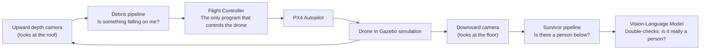

<p align="center">
  
</p>

# Vision-Language UAV Navigation for GPS-Denied Environments

### Vision-Language Navigation | UAV | Computer Vision | GPS-Denied Navigation | ROS 2 | PX4 | Gazebo

---

## Team Members

| S. No. | Name | Roll Number | Email |
|---|---|---|---|
| 1 | JENISHAA BHARATHI M | CB.SC.U4AIE24221 | cb.sc.u4aie24221@cb.students.amrita.edu |
| 2 | NAVEEN K | CB.SC.U4AIE24235 | cb.sc.u4aie24235@cb.students.amrita.edu |
| 3 | POOJA N | CB.SC.U4AIE24242 | cb.sc.u4aie24242@cb.students.amrita.edu |
| 4 | PRANESH M | CB.SC.U4AIE24345 | cb.sc.u4aie24345@cb.students.amrita.edu |
| 5 | SANDHIYA D | CB.SC.U4AIE24353 | cb.sc.u4aie24353@cb.students.amrita.edu |

---

## Table of Contents

1. [The Project in One Minute](#1-the-project-in-one-minute)
2. [Why This Problem Matters](#2-why-this-problem-matters)
3. [Key Terms Used in This README](#3-key-terms-used-in-this-readme)
4. [How the System Works (Big Picture)](#4-how-the-system-works-big-picture)
5. [Part 1 – Flying the Drone](#5-part-1--flying-the-drone)
6. [Part 2 – Avoiding Falling Debris](#6-part-2--avoiding-falling-debris)
7. [Part 3 – Finding Survivors](#7-part-3--finding-survivors)
8. [The Simulated World](#8-the-simulated-world)
9. [What Is Inside This Repository](#9-what-is-inside-this-repository)
10. [Results](#10-results)
11. [Testing](#11-testing)
12. [How to Build and Run](#12-how-to-build-and-run)
13. [Current Limitations and Next Steps](#13-current-limitations-and-next-steps)
14. [Base Paper](#14-base-paper)
15. [License](#15-license)

---

## 1. The Project in One Minute

Imagine a building has collapsed after an earthquake. Rescue teams want to know if anyone is trapped inside, but it is too dangerous to send people in first.

**Our idea:** send a drone in instead.

But a drone inside a collapsed building faces three big problems:

| Problem | Why it is hard | What our system does |
|---|---|---|
| **No GPS** | GPS signals do not reach inside buildings | The drone uses only its own onboard sensors to know where it is |
| **Falling debris** | Pieces of the broken roof can fall at any moment | An upward-facing camera spots falling objects and the drone moves out of the way |
| **Finding people** | The drone must decide whether something it sees is a person | A downward camera finds possible survivors, and an AI model that understands images and language (a **Vision-Language Model**) double-checks them |

Everything runs in a **computer simulation**, so we can test safely without crashing a real drone.

---

## 2. Why This Problem Matters

Most drones today fly by following GPS points or by being controlled by a pilot. Neither works well in disaster zones:

- GPS does not work indoors or under rubble.
- A pilot outside cannot see what the drone sees quickly enough to dodge something falling.
- Drones that only follow fixed instructions cannot "understand" what they are looking at.

Our project is a step towards drones that can **see, understand and react on their own** in such places.

---

## 3. Key Terms Used in This README

If you are new to drones or robotics, these short explanations will help.

| Term | Simple meaning |
|---|---|
| **UAV** | Unmanned Aerial Vehicle, i.e. a drone |
| **GPS-denied** | A place where GPS does not work, like inside a building |
| **PX4** | Free, open-source software that keeps a drone stable in the air. It is the drone's "autopilot" |
| **Offboard mode** | A PX4 mode where an outside program tells the drone where to go |
| **ROS 2** | Robot Operating System. It lets different programs (called **nodes**) send messages to each other |
| **Node** | One small program in ROS 2 that does one job, for example "detect debris" |
| **Topic** | A named channel nodes use to send messages, for example `/camera/image_raw` |
| **Gazebo** | A 3D simulator with realistic physics and cameras |
| **SITL** | Software-In-The-Loop: running the real PX4 autopilot on a computer instead of a real drone |
| **Depth camera** | A camera that measures how far away each point is, not just its colour |
| **VLM** | Vision-Language Model: an AI that can look at an image and answer questions about it in words |
| **Kalman filter** | A maths method that combines noisy measurements over time to get a better estimate of where something is and how fast it moves |
| **Ground truth** | The exact true positions known by the simulator. We use it only to **check** our results, never to help the drone |

---

## 4. How the System Works (Big Picture)

The drone has **two cameras** and runs **three main jobs** at the same time.


```mermaid
flowchart LR
    A["Upward depth camera<br/>(looks at the roof)"] --> B["Debris pipeline<br/>Is something falling on me?"]
    C["Downward camera<br/>(looks at the floor)"] --> D["Survivor pipeline<br/>Is there a person below?"]
    D --> E["Vision-Language Model<br/>Double-checks: is it really a person?"]
    B --> F["Flight Controller<br/>The only program that controls the drone"]
    F --> G["PX4 Autopilot"]
    G --> H["Drone in Gazebo simulation"]
    H --> A
    H --> C
```

Two important rules we followed:

1. **Only one program controls the drone.** The flight controller is the only program allowed to send commands to PX4. Other programs can only *suggest* a move, and the flight controller checks the suggestion is safe before using it.
2. **The drone never cheats.** The drone only uses what its own cameras and sensors can see. The simulator's true positions are saved separately and used only afterwards to grade how well the drone did.

---

## 5. Part 1 – Flying the Drone

**File:** `src/uav_autonomy/uav_autonomy/flight_controller.py`

The flight controller makes the drone fly a full mission by itself. It goes through these steps one after another:

```text
Wait for sensor data
      ↓
Switch PX4 to Offboard mode
      ↓
Arm the motors
      ↓
Take off to 3 metres
      ↓
(Optional) Fly to waypoint 1 → waypoint 2 → back home
      ↓
Hover
      ↓
Land
      ↓
Done
```

If anything goes wrong at any step (for example a timeout), it switches to a **failsafe** state.

Supporting files:

| File | What it does |
|---|---|
| `flight_safety.py` | Watches the drone's position and raises a flag if it goes outside safe limits (for example too high or too low) |
| `avoidance_interface.py` | The safety rules used to accept or reject a dodge suggestion |
| `state_bridge.py` | Converts the drone's position from PX4's coordinate system to the one ROS 2 tools use, so it can be shown in visual tools like RViz |

---

## 6. Part 2 – Avoiding Falling Debris

### Why an upward camera?

At first we only had the normal downward camera. We tested it with 20 falling objects and found it **never saw a single one in time**. So we added an **upward-facing depth camera** that looks at the roof. This gave the drone about **1 second of warning** on average, which is enough to move.

### The five steps

The debris system works like a chain. Each step passes its result to the next.

```text
1. DETECT     →  2. TRACK      →  3. PREDICT     →  4. ASSESS RISK   →  5. DODGE
"I see an        "That's the       "It will land     "It will hit me     "Move 1 m
 object above"    same object       here in 1.2 s"    in 0.8 s!"          to the left"
                  as before"
```

| Step | What happens, in simple words | Files |
|---|---|---|
| **1. Detect** | Looks at the depth image, finds blobs that are closer than the roof, and works out their 3D position | `debris_detection.py`, `debris_depth_detector.py` |
| **2. Track** | Matches each new detection to objects seen earlier, so every falling object gets an ID and a speed (uses a Kalman filter) | `debris_tracking.py`, `debris_tracker.py` |
| **3. Predict** | Guesses where each object will be in the next 2 seconds. We tried three ways: constant speed, estimated acceleration, and **gravity**. Gravity was by far the best | `debris_prediction.py`, `debris_predictor.py` |
| **4. Assess risk** | Checks how close each object will come to the drone and labels it **SAFE**, **WATCH**, **WARNING** or **CRITICAL** | `debris_risk.py`, `debris_risk_node.py` |
| **5. Dodge** | Tries many possible moves (stay, move left, right, forward, down…), simulates how the drone would actually fly each one, throws away any that are unsafe, and picks the best of the rest | `debris_avoidance.py`, `debris_avoidance_node.py` |

The dodge step only **suggests** a move. The flight controller checks it and decides.

**Debris for testing** is dropped in the simulator by `continuous_debris_spawner.py`. It drops real physical boxes that fall under gravity, and uses a fixed random seed so every test can be repeated exactly.

---

## 7. Part 3 – Finding Survivors

In our simulated building there is a **manikin** (a dummy person) wearing orange clothes, with a skin-coloured head and blue legs.

### The three steps

```text
1. FIND CANDIDATES    →    2. CONFIRM OVER TIME    →    3. ASK THE VLM
"There's something         "I've seen it in many         "Is this really
 orange and person-          frames, it's not a            a person?"
 shaped down there"          one-off glitch"
```

| Step | What happens, in simple words | File |
|---|---|---|
| **1. Find candidates** | Looks for orange regions in the image, then checks whether a head, legs and a body-like shape are attached. Gives a score from 0 to 1 | `survivor_detection.py` |
| **2. Confirm over time** | Ignores anything seen in only one frame. A candidate must appear again and again before it is reported | `survivor_confirmation.py` |
| **3. Ask the VLM** | Cuts out a small image of the candidate and sends it to a Vision-Language Model to check if it is a person | `vlm_client.py` |

All three are joined together in `survivor_perception_node.py`.

### How we ask the VLM

We ask in **two separate questions**:

1. *"Describe the main object in this picture."* (We do not mention people, so we don't lead the AI.)
2. *"Does this description sound like a person?"*

We first tried asking directly *"Is this a person?"*, but the small AI models we used either said **yes to everything** or **no to everything**, depending on the wording. Splitting it into two questions fixed this.

### What the drone reports

| Label | Meaning |
|---|---|
| `CANDIDATE` | Looks like a person, waiting for the VLM to answer |
| `SURVIVOR_CONFIRMED` | The VLM agrees it is a person |
| `UNCERTAIN` | Not sure, or the detector and the VLM disagree |
| `REJECTED` | Not a person |

If the VLM is switched off or fails, the drone **never** says "confirmed". It stays at `CANDIDATE` or `UNCERTAIN`.

### Finding the survivor's position in 3D

**Files:** `survivor_localization.py`, `survivor_localization_node.py`

A single camera image only tells you the **direction** of the person, not how far away they are. So the drone combines views from different positions as it flies. Where the lines of sight cross, that is where the person is (this is called **triangulation**). The result is the survivor's position in the drone's own map.

---

## 8. The Simulated World

| File | What it is |
|---|---|
| `worlds/collapsed_building_rescue.sdf` | The main world: a building with broken walls, a hole in the roof, fallen concrete, rubble and the survivor manikin |
| `worlds/depth_validation.sdf` | An empty world used only to test that the depth camera measures distances correctly |
| `worlds/survivor_variants/` | Six versions of the main world for testing the survivor search (see below) |
| `models/x500_rescue/` | Our drone: the PX4 X500 quadcopter with a downward camera and an upward depth camera |
| `models/depth_cam_up/` | The upward depth camera (640×480 pixels, 30 frames per second, sees from 0.2 m to 35 m) |

The six test worlds:

| World | What is different | What it tests |
|---|---|---|
| `occluded` | A panel partly hides the survivor | Can it still find a partly hidden person? |
| `rubble` | Rubble around the survivor | Can it handle a cluttered scene? |
| `outdoor` | Survivor in an open area | Different lighting and background |
| `none` | No survivor at all | Does it wrongly "find" someone who isn't there? |
| `multi` | Several survivors | Can it find more than one? |
| `distractors` | Orange and skin-coloured objects that are not people | Can it avoid being fooled? |

---

## 9. What Is Inside This Repository

```text
├── amrita.png                  University logo
├── LICENSE                     MIT License
├── README.md                   This file
│
├── src/uav_autonomy/           The main ROS 2 package
│   ├── uav_autonomy/           All the Python code (flight, debris, survivors)
│   ├── worlds/                 Simulated environments
│   ├── models/                 The drone and its cameras
│   ├── config/                 Settings for connecting Gazebo cameras to ROS 2
│   ├── launch/                 A launch file to start the perception nodes together
│   └── test/                   Automatic tests
│
├── scripts/                    Tools to run flights and grade results
│   ├── run_flight_trial.sh     Starts the whole simulation and flies one mission
│   ├── demo_live.sh            A visual demo with falling debris
│   ├── sensor_study/           Experiments to decide which camera to use
│   ├── sensor_integration/     Checks that the camera and clocks are correct
│   ├── perception/             Grades debris detection, tracking, prediction and risk
│   ├── avoidance/              Runs and grades debris-dodging flights
│   └── survivor/               Runs and grades survivor-search flights
│
├── simulation/object-track/    Our first prototype (see below)
│
└── results/final/figures/      The 20 result images shown in Section 10
```

### Main programs in the package

| Program | Job |
|---|---|
| `flight_controller` | Flies the mission; the only program that commands the drone |
| `state_bridge` | Shares the drone's position with other ROS 2 tools |
| `debris_depth_detector` | Step 1 of debris: detect |
| `debris_tracker` | Step 2 of debris: track |
| `debris_predictor` | Step 3 of debris: predict |
| `debris_risk` | Step 4 of debris: assess risk |
| `debris_avoidance` | Step 5 of debris: suggest a dodge |
| `debris_perception` | A simpler debris detector that uses the normal camera |
| `survivor_perception` | Finds survivors and asks the VLM |
| `survivor_localization` | Works out where survivors are in 3D |
| `continuous_debris_spawner` | Drops test debris in the simulator |

### Older files kept for reference

`rescue_mission.py` (and its `.backup`), `vlm_detector.py` and `vlm_perception.py` are from our **first attempt**, where everything was in one program and detection used simple colour matching. The files `dynamic_obstacle_simulator.py`, `dynamic_obstacle_tracker.py` and `dynamic_obstacle_vision.py` are empty placeholders from that stage. They are not used by the final system.

### Our first prototype

`simulation/object-track/` is where the project began. Using a lighter simulator called **PyBullet**, a drone follows a moving green ball using only its camera:

- `moving_target.py` moves the ball in a circle, figure-8 or random path.
- `camera_tracker.py` finds the green ball in the image and uses **PID controllers** to turn "the ball is to the left of centre" into "move left".
- `track_demo.py` runs it. You can move the ball yourself with the W/A/S/D/R/F keys.

```bash
cd simulation/object-track
pip install -r requirements.txt
python3 track_demo.py
```

---

## 10. Results

All result images are in `results/final/figures/`.

### Choosing the right camera

| Camera | Average warning before debris reaches the drone |
|---|---|
| Normal downward camera | **0.00 s** (it saw none of the 20 falling objects in time) |
| Upward depth camera | **about 0.98 s** |

This is why we added the upward camera. (See figures `03` and `04`.)

### How well we predict where debris will fall

Error 2 seconds into the future (lower is better):

| Method | Error |
|---|---|
| Assume constant speed | 19.06 m |
| Estimate acceleration | 10.81 m |
| **Use gravity** | **0.41 m** |

(See figure `07`.)

### Dodging falling debris

| Test | What happens | Hits | Closest distance |
|---|---|---|---|
| Direct hits | Boxes dropped straight onto the drone | 0 out of 3 | 1.66 m |
| Multiple objects | Several boxes falling at once | 0 out of 5 | 0.91 m |
| Fast flight | Drone flying at 4.4 m/s | 0 out of 3 | 2.68 m |
| Camera gap | Camera blacks out for 0.5 s | 0 out of 3 | 0.64 m |
| Hard acceleration | Drone already speeding up hard | **1 out of 3** | 0.37 m |
| Sideways throw | Box thrown sideways, not dropped | **1 out of 3** | 0.16 m |

The last two are **failures**, and we have included them on purpose. They show the situations our system cannot yet handle. (See figures `09` to `14`.)

### Finding survivors

| Figure | What it shows |
|---|---|
| `15_survivor_confirmed_by_vlm.jpg` | A survivor found and confirmed by the VLM |
| `16_survivor_distractor_scene.jpg` | Orange objects correctly rejected as "not a person" |
| `17_survivor_outdoor_pass.jpg` | A case where the detector and VLM disagree, so the drone reports "uncertain" |
| `18_vlm_dataset_samples.jpg` | Example image crops used to test the VLM |

### Final demo check (06-10-2026)

| Figure | What it shows |
|---|---|
| `19_demo_check_2026-10-06_avoidance.png` | Direct-hit test repeated: 0 hits out of 3, closest distance 1.83 m |
| `20_demo_check_2026-10-06_survivor_candidate.jpg` | With the VLM turned off, the drone correctly stops at "candidate" and does not claim a confirmed survivor |

### Demo video

https://github.com/user-attachments/assets/437d402a-7b3b-4a8a-8b44-ca0b5fdd62d4

---

## 11. Testing

The folder `src/uav_autonomy/test/` contains **318 automatic tests** that check each part of the code works as expected, plus code-style checks.

| What is tested | Number of tests |
|---|---|
| Survivor perception | 79 |
| Debris avoidance | 68 |
| Debris tracking | 36 |
| Debris risk | 35 |
| Survivor localisation | 35 |
| Debris prediction | 22 |
| Debris detection | 21 |
| Flight safety | 21 |

To run them:

```bash
colcon test --packages-select uav_autonomy
colcon test-result --verbose
```

---

## 12. How to Build and Run

### What you need

- Ubuntu with **ROS 2 Jazzy**
- **PX4-Autopilot** with Gazebo (the scripts look for it in a folder next to this project called `PX4-Autopilot`)
- The `px4_msgs` and `uav_interfaces` message packages in the same ROS 2 workspace
- `ros_gz_bridge` and the Micro XRCE-DDS Agent
- Python libraries: `numpy`, `scipy`, `opencv`
- *(Optional)* A Vision-Language Model server, for example Ollama, for survivor checking

### Build

```bash
source /opt/ros/jazzy/setup.bash
cd <your_workspace>
colcon build --packages-select uav_autonomy
source install/setup.bash
```

### Run

```bash
# Fly one simple mission (take off, hover, land)
scripts/run_flight_trial.sh results/trial_01 hover

# Watch a live demo with falling debris
scripts/demo_live.sh

# Debris test: first without dodging, then with dodging
scripts/avoidance/run_scenario.sh C_direct baseline
scripts/avoidance/run_scenario.sh C_direct avoid

# Survivor search using a VLM
export VLM_ENDPOINT=http://localhost:11434/v1
export VLM_MODEL=<model-name>
scripts/survivor/run_scenario.sh A_clear
```


---

## 13. Base Paper

This project is inspired by the UAV Vision-Language Navigation problem studied in:

> **Towards Realistic UAV Vision-Language Navigation: Platform, Benchmark, and Methodology**

**Paper:**  
https://arxiv.org/pdf/2410.07087

**TravelUAV Repository:**  
https://github.com/buaa-colalab/TravelUAV

The paper provides the research foundation for the Vision-Language Navigation aspect of this project, while this repository develops an independent simulation and ROS 2–PX4 based implementation.

---

## 14. License

This project is released under the MIT License. See [`LICENSE`](LICENSE).

---

<div align="center">

### Amrita Vishwa Vidyapeetham

**Vision-Language UAV Navigation for GPS-Denied Environments**

</div>
