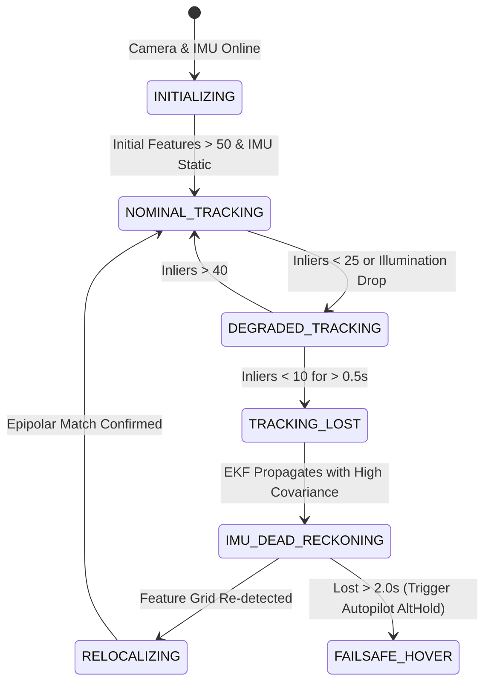

# Member 4 Architecture Specification: GPS-Denied Navigation Stack

## 1. System Overview
The GPS-Denied Navigation Suite provides continuous, drift-resilient 6-DoF state estimation, multi-sensor Extended Kalman Filter (EKF) fusion, occupancy mapping, and flight controller interfacing for autonomous drones operating without GNSS satellite reception.

```mermaid
graph TD
    subgraph SENSORS["Onboard Perception & Sensors"]
        CAM["Forward Camera (640x480 @ 30 FPS)"]
        IMU["IMU (Accel + Gyro @ 100 Hz)"]
        RF["Rangefinder / Sonar (Z-Altitude @ 20 Hz)"]
    end

    subgraph MEMBER4["Member 4 Navigation Pipeline"]
        FT["Feature Tracker (KLT + FAST + Bucketing)"]
        VO["Visual Odometer (5-Point E-Matrix + PnP)"]
        EKF["15-State Error-State EKF Fusion (50 Hz)"]
        TF["TF2 Coordinate Broadcaster"]
        MB["MAVROS Vision Bridge (ENU -> NED)"]
        OG["Occupancy Grid & Obstacle Map (10cm)"]
        DIAG["SLAM Health & Diagnostics Monitor"]
    end

    subgraph FLIGHT_STACK["Flight Controller & Autopilot"]
        FCU["ArduPilot / PX4 EKF2"]
    end

    subgraph SYSTEM_INTEGRATION["Team Cross-Interfaces"]
        M1["Member 1: VLM Navigation (TravelUAV)"]
        M5["Member 5: Adaptive Semantic Memory"]
    end

    CAM --> FT
    FT --> VO
    VO -->|/vo/odom [30Hz]| EKF
    VO -->|/vo/sparse_map| OG
    IMU -->|/imu/data [100Hz]| EKF
    RF -->|/rangefinder/range [20Hz]| VO
    RF -->|/rangefinder/range [20Hz]| EKF

    EKF -->|/odom/filtered [50Hz]| TF
    EKF -->|/odom/filtered [50Hz]| MB
    EKF -->|/odom/filtered [50Hz]| OG
    EKF -->|/odom/filtered [50Hz]| M1
    EKF -->|/odom/filtered [Keyframes]| M5
    OG -->|/map, /costmap/costmap| M1

    MB -->|/mavros/vision_pose/pose [30Hz NED]| FCU
    EKF -->|/diagnostics| DIAG
    VO -->|/diagnostics| DIAG
```

---

## 2. Real-Time Data Pipeline & Latency Budgets

| Pipeline Stage | Algorithm / Component | Input | Output | Target Frequency | Max Latency |
| :--- | :--- | :--- | :--- | :--- | :--- |
| **Feature Extraction** | FAST + Grid Bucketing | 640x480 Grayscale | ~200 Keypoints | 30 Hz | < 4 ms |
| **Optical Flow** | Pyramidal Lucas-Kanade + F-B Check | Consecutive Frames | Valid Correspondences | 30 Hz | < 8 ms |
| **Motion Recovery** | 5-Pt Essential Mat + RANSAC | 2D-2D Matches + Altitude | $\mathbf{R}_{\text{rel}}, \mathbf{t}_{\text{rel}}$, 3D Points | 30 Hz | < 6 ms |
| **IMU Propagation** | 15-State ES-EKF Prediction | Accel ($a_m$), Gyro ($\omega_m$) | Continuous Pose/Vel | 100 Hz | < 0.5 ms |
| **Measurement Update** | Joseph-Form Kalman Update | VO Pose + Rangefinder | Filtered $\mathbf{x}$, Covariance $\mathbf{P}$ | 50 Hz | < 1 ms |
| **MAVROS Bridging** | REP-103 ENU $\rightarrow$ NED Frame | Filtered Odometry | `/mavros/vision_pose/pose` | 30 Hz | < 0.5 ms |
| **Occupancy Mapping** | Log-Odds Bayesian Ray-Tracing | Triangulated 3D Pointcloud | `/map`, `/costmap/costmap` | 5 Hz | < 15 ms |

---

## 3. Fault Tolerance & Tracking Recovery State Machine



1. **Nominal Tracking**: Features $\ge 50$, full 6-DoF visual updates injected into EKF.
2. **Degraded Tracking**: Low texture / rapid yaw; EKF increases VO measurement covariance and relies more heavily on IMU integration.
3. **Tracking Lost / Failsafe**: If VO drops out completely, EKF switches to dead-reckoning with rangefinder altitude hold, publishing warning diagnostics to flight controller to hold position.
