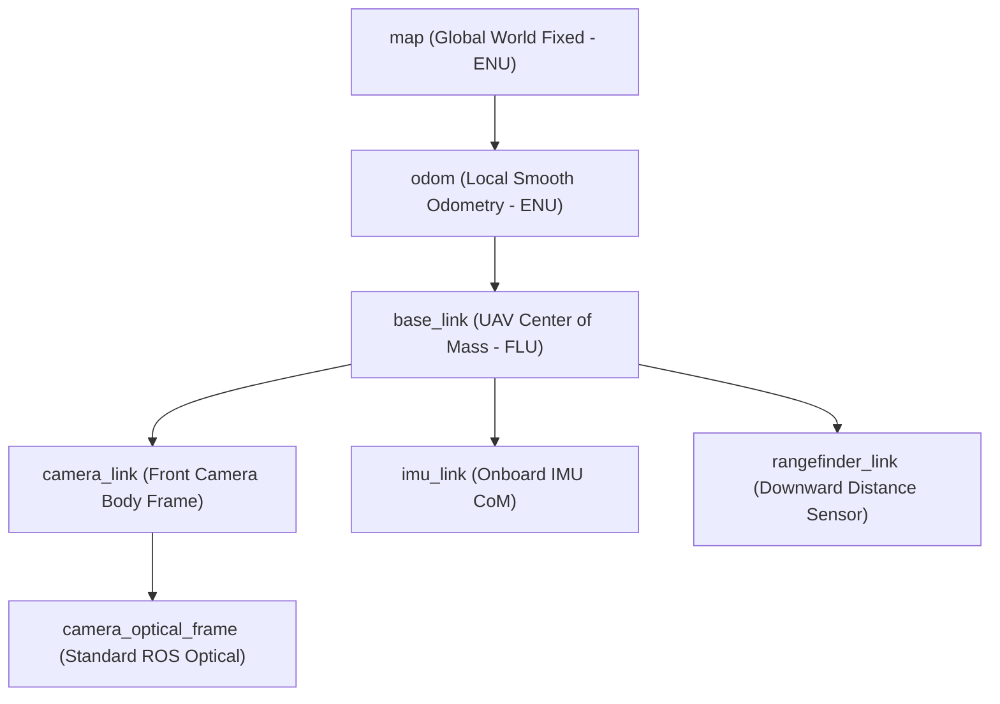

# Coordinate Frames & Transformation Specifications (REP-103 / REP-105)

## 1. Overview
In GPS-denied UAV navigation, maintaining precise, unambiguous coordinate frame transformations is vital to prevent flight instability and crash scenarios. This document formalizes the coordinate systems used across the Member 4 stack and their integration with ROS 2, MAVROS, ArduPilot, and PX4.

---

## 2. Standard TF2 Transform Hierarchy

### Frame Definitions:
1. **`map`**: Fixed global reference frame. For GPS-denied missions, its origin is the takeoff position ($x=0, y=0, z=0$, yaw=0). Coordinates follow **ENU** (East-North-Up).
2. **`odom`**: Continuous, drift-free local odometry frame published by the 15-state EKF.
3. **`base_link`**: Attached to the UAV center of mass. Follows **FLU** (Forward-Left-Up).
4. **`camera_link`**: Rigid mechanical mount of the camera on the drone airframe.
5. **`camera_optical_frame`**: Standard computer vision optical frame where:
   - $+X$: Points to the **right** of the image.
   - $+Y$: Points **downwards** in the image.
   - $+Z$: Points **forward** along the camera optical axis.
6. **`imu_link`**: Frame aligned with the IMU accelerometer and rate gyroscopes.

---

## 3. Frame Conventions Comparison

| Frame Standard | Axis $X$ | Axis $Y$ | Axis $Z$ | Used By |
| :--- | :--- | :--- | :--- | :--- |
| **ROS REP-103 (ENU)** | East / Forward-Right | North / Forward-Left | Up (Opposite Gravity) | ROS 2, Nav2, RViz2 |
| **Aviation / ArduPilot / PX4 (NED)** | North / Forward | East / Right | Down (Towards Gravity) | MAVROS, ArduCopter, PX4 EKF2 |
| **Camera Optical** | Right | Down | Forward | OpenCV, ORB-SLAM3, RTAB-Map |
| **Robot Body (FLU)** | Forward | Left | Up | Drone Base Link |

---

## 4. Mathematical Conversion: ROS (ENU) $\leftrightarrow$ MAVROS (NED)

The transformation matrix $\mathbf{R}_{\text{ENU} \rightarrow \text{NED}}$ is:

$$\mathbf{R}_{\text{ENU} \rightarrow \text{NED}} = \begin{bmatrix} 0 & 1 & 0 \\ 1 & 0 & 0 \\ 0 & 0 & -1 \end{bmatrix}$$

### Position Transformation:
$$\begin{bmatrix} x_{\text{NED}} \\ y_{\text{NED}} \\ z_{\text{NED}} \end{bmatrix} = \begin{bmatrix} 0 & 1 & 0 \\ 1 & 0 & 0 \\ 0 & 0 & -1 \end{bmatrix} \begin{bmatrix} x_{\text{ENU}} \\ y_{\text{ENU}} \\ z_{\text{ENU}} \end{bmatrix} = \begin{bmatrix} y_{\text{ENU}} \\ x_{\text{ENU}} \\ -z_{\text{ENU}} \end{bmatrix}$$

### Orientation (Rotation Matrix) Transformation:
$$\mathbf{R}_{\text{NED}} = \mathbf{R}_{\text{ENU} \rightarrow \text{NED}} \cdot \mathbf{R}_{\text{ENU}} \cdot \mathbf{R}_{\text{ENU} \rightarrow \text{NED}}^T$$

### Camera Optical to Drone Body Transformation:
$$\mathbf{R}_{\text{optical} \rightarrow \text{body}} = \begin{bmatrix} 0 & 0 & 1 \\ -1 & 0 & 0 \\ 0 & -1 & 0 \end{bmatrix}$$

This conversion is implemented and handled automatically in `gps_denied_nav/bridge/mavros_vision_bridge.py`.
